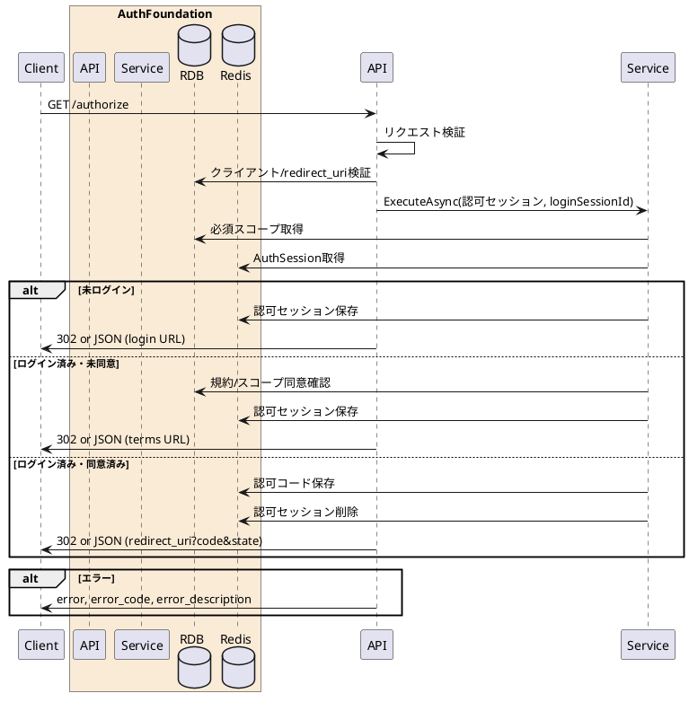

---

description: OIDC Authorization Code + PKCE の認可リクエストを処理する

---

# 認可 <!-- omit in toc -->

## 1. API概要

OIDC Authorization Code + PKCE フローの認可リクエストを検証し、ログイン画面、同意画面、またはクライアントの `redirect_uri` へ遷移させる。

### 1.1. リクエスト

#### 1.1.1. エンドポイント

``` text
GET /authorize
```

#### 1.1.2. リクエストヘッダ

| # | 物理名 | 論理名 | 型 | サイズ | 必須 | フォーマット | 補足事項 |
| --: | :-- | -- | -- | --: | :--: | -- | -- |
| 1. | x-auth-ui-response-mode | JSON遷移先返却モード | string | 4 | - | `^json$` | `json` 指定時は302ではなくJSONで遷移先URLを返却 |
| 2. | Cookie | 認証セッションCookie | string | - | - | - | `AuthSessionId` が存在する場合はログイン済みとして扱う |

#### 1.1.3. リクエストパラメータ

| # | 物理名 | 論理名 | 型 | サイズ | 必須 | フォーマット | 補足事項 |
| --: | :-- | -- | -- | --: | :--: | -- | -- |
| 1. | response_type | レスポンスタイプ | string | 4 | ○ | `^code$` | 認可コードフロー固定値 |
| 2. | client_id | クライアントID | string | 32 | ○ | `^[0-9]{32}$` | - |
| 3. | redirect_uri | リダイレクトURI | string | - | ○ | `https://...` または許可済みローカルHTTP | クライアント登録値と完全一致 |
| 4. | state | state | string | 1-255 | ○ | `^.{1,255}$` | CSRF対策用 |
| 5. | scope | スコープ | string | - | ○ | `^[A-Za-z0-9_ ]+$` | 空白区切り |
| 6. | code_challenge_method | PKCE方式 | string | 4 | ○ | `^S256$` | S256固定 |
| 7. | code_challenge | PKCEチャレンジ | string | 43-128 | ○ | `^[A-Za-z0-9._~-]{43,128}$` | - |
| 8. | nonce | nonce | string | 1-255 | ○ | `^.{1,255}$` | IDトークン再生対策 |

### 1.2. レスポンス

#### 1.2.1. レスポンスヘッダ

| # | 物理名 | 論理名 | 型 | サイズ | 必須 | フォーマット | 補足事項 |
| --: | :-- | -- | -- | --: | :--: | -- | -- |
| 1. | Location | 遷移先URL | string | - | - | URI | 通常モード時のみ。ログイン画面、同意画面、または `redirect_uri` |
| 2. | Set-Cookie | 認可セッションCookie | string | - | - | - | 認可セッション発行時のみ `AuthRequestSessionId` と互換用 `session_id` を設定 |
| 3. | Cache-Control | キャッシュ制御 | string | - | ○ | `no-store` | - |
| 4. | Pragma | キャッシュ制御 | string | - | ○ | `no-cache` | - |

#### 1.2.2. レスポンスパラメータ

`x-auth-ui-response-mode=json` 指定時のみJSONを返却する。認可セッションIDはレスポンスBodyに含めず、Cookieで引き継ぐ。

| # | 物理名 | 論理名 | 型 | サイズ | 必須 | フォーマット | 補足事項 |
| --: | :-- | -- | -- | --: | :--: | -- | -- |
| 1. | result | 処理結果 | string | - | ○ | `redirect` | - |
| 2. | redirect_url | 遷移先URL | string | - | ○ | URI | ログイン画面、同意画面、またはクライアントの `redirect_uri` |
| 3. | response_code | レスポンスコード | string | 5 | ○ | `^[0-9]{5}$` | 正常時 `00000` |
| 4. | message | メッセージ | string | - | ○ | - | 正常時は空文字 |

## 2. API詳細

### 2.1. 処理内容

| # | 処理概要 | 補足事項 |
| --: | -- | -- |
| 1. | リクエストパラメータ確認 | 必須項目または形式が不正な場合は `invalid_request` |
| 2. | クライアント検証 | クライアントIDとリダイレクトURIを検証。存在しない場合は `unauthorized_client` |
| 3. | 要求スコープ検証 | クライアント必須スコープが要求スコープに含まれない場合は `invalid_scope` |
| 4. | 認証セッション確認 | `AuthSessionId` Cookieが有効な場合はログイン済みとして扱う |
| 5. | 同意状態確認 | 必須規約と要求スコープへの同意状態を確認 |
| 6. | 認可コード発行 | ログイン済みかつ同意済みの場合、認可コードをRedisへ保存し `redirect_uri` に `code` と `state` を付与 |
| 7. | 認可セッション発行 | 未ログインまたは未同意の場合、認可セッションをRedisへ保存し、ログイン画面または同意画面へ遷移 |

### 2.2. シーケンス



### 2.3. エラーコード

| HTTPレスポンス | error | error_code | error_description |
| -- | -- | -- | -- |
| 400 | invalid_request | 00001 | リクエストパラメータエラー |
| 400 | unauthorized_client | 00002 | 不正なクライアント |
| 400 | invalid_request | 00005 | リダイレクトURIが不正 |
| 400 | invalid_scope | 00009 | スコープが不正 |
| 500 | server_error | 90000 | サーバーで予期しないエラーが発生しました |
