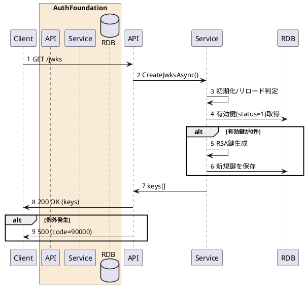

---

description: OIDC公開鍵セット（JWKS）を取得する

---

# JWKs取得 <!-- omit in toc -->

## 1. API概要

OIDCで発行するIDトークンの署名検証に利用する公開鍵セット（JWKS）を返却する。

### 1.1. リクエスト

#### 1.1.1. エンドポイント

``` text
GET /jwks
```

#### 1.1.2. リクエストヘッダ

なし

#### 1.1.3. リクエストパラメータ

なし

### 1.2. レスポンス

#### 1.2.1. レスポンスヘッダ

| # | 物理名 | 論理名 | 型 | サイズ | 必須 | フォーマット | 補足事項 |
| --: | :-- | -- | -- | --: | :--: | -- | -- |
| 1. | Content-Type | コンテンツタイプ | string | - | ○ | - | `application/json` |

#### 1.2.2. レスポンスパラメータ

| # | 物理名 | 論理名 | 型 | サイズ | 必須 | フォーマット | 補足事項 |
| --: | :-- | -- | -- | --: | :--: | -- | -- |
| 1. | keys | 公開鍵一覧 | array(object) | - | ○ | - | 1件以上（有効鍵が存在しない場合は内部生成） |
| 2. | keys[].kid | 鍵ID | string | - | ○ | Base64URL相当 | 署名鍵識別子 |
| 3. | keys[].kty | 鍵種別 | string | - | ○ | `RSA` | - |
| 4. | keys[].alg | 署名アルゴリズム | string | - | ○ | `RS256` | - |
| 5. | keys[].use | 用途 | string | - | ○ | `sig` | 署名用途 |
| 6. | keys[].n | RSA公開鍵modulus | string | - | ○ | Base64URL | - |
| 7. | keys[].e | RSA公開鍵exponent | string | - | ○ | Base64URL | - |

## 2. API詳細

### 2.1. 処理内容

| # | 処理概要 | 補足事項 |
| --: | -- | -- |
| 1. | 鍵情報の初期化判定 | 初回起動時、または `JwkSigningKeyReloadSec` 経過時に鍵情報を再読込 |
| 2. | 有効JWK取得 | `jwk_master` テーブルから `status=1` を更新日時降順で取得 |
| 3. | JWK自動生成（必要時） | 有効鍵0件の場合、RSA鍵ペアを生成して `jwk_master` に保存 |
| 4. | JWKSレスポンス生成 | 取得済み公開鍵を `keys[]` に整形して返却 |
| 5. | 例外処理 | 予期しない例外発生時はインターナルサーバーエラー（code:90000） |

### 2.2. シーケンス



### 2.3. エラーコード

| HTTPレスポンス | code | 説明 | 補足事項 |
| -- | -- | -- | -- |
| 500 | 90000 | 認証基盤のインターナルサーバーエラー | 予期しない例外 |
