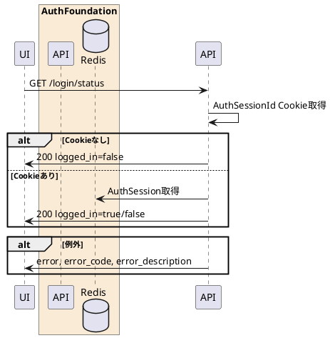

---

description: 認証セッションCookieからログイン状態を取得する

---

# ログイン状態取得 <!-- omit in toc -->

## 1. API概要

`AuthSessionId` Cookieの有無とRedis上の認証セッションを確認し、ログイン状態を返却する。

### 1.1. リクエスト

#### 1.1.1. エンドポイント

``` text
GET /login/status
```

#### 1.1.2. リクエストヘッダ

| # | 物理名 | 論理名 | 型 | サイズ | 必須 | フォーマット | 補足事項 |
| --: | :-- | -- | -- | --: | :--: | -- | -- |
| 1. | Cookie | 認証セッションCookie | string | - | - | - | `AuthSessionId` |

#### 1.1.3. リクエストパラメータ

なし

### 1.2. レスポンス

#### 1.2.1. レスポンスヘッダ

| # | 物理名 | 論理名 | 型 | サイズ | 必須 | フォーマット | 補足事項 |
| --: | :-- | -- | -- | --: | :--: | -- | -- |
| 1. | Content-Type | コンテンツタイプ | string | - | ○ | - | `application/json` |
| 2. | Cache-Control | キャッシュ制御 | string | - | ○ | `no-store` | - |
| 3. | Pragma | キャッシュ制御 | string | - | ○ | `no-cache` | - |

#### 1.2.2. レスポンスパラメータ

| # | 物理名 | 論理名 | 型 | サイズ | 必須 | フォーマット | 補足事項 |
| --: | :-- | -- | -- | --: | :--: | -- | -- |
| 1. | response_code | レスポンスコード | string | 5 | ○ | `^[0-9]{5}$` | 正常時 `00000` |
| 2. | logged_in | ログイン状態 | boolean | - | ○ | - | 認証セッションが有効な場合 `true` |

## 2. API詳細

### 2.1. 処理内容

| # | 処理概要 | 補足事項 |
| --: | -- | -- |
| 1. | Cookie取得 | `AuthSessionId` Cookieを取得 |
| 2. | 認証セッション取得 | Cookieが存在する場合、Redisから認証セッションを取得 |
| 3. | ログイン状態返却 | セッションが存在し復元できる場合は `logged_in=true`、それ以外は `false` |

### 2.2. シーケンス



### 2.3. エラーコード

| HTTPレスポンス | error | error_code | error_description |
| -- | -- | -- | -- |
| 500 | server_error | 90000 | サーバーで予期しないエラーが発生しました |
