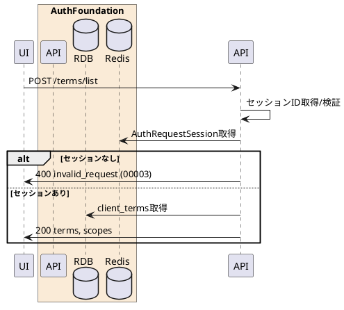

---

description: 認可セッションに紐づく同意対象規約とスコープを取得する

---

# 規約取得 <!-- omit in toc -->

## 1. API概要

認可セッションIDを用いて、同意画面に表示する規約一覧と要求スコープ一覧を取得する。

### 1.1. リクエスト

#### 1.1.1. エンドポイント

``` text
POST /terms/list
```

`GET /terms` も同等の規約取得用途で利用できる。ただし `GET /terms` は `x-session-id` ヘッダーを必須とする。

#### 1.1.2. リクエストヘッダ

| # | 物理名 | 論理名 | 型 | サイズ | 必須 | フォーマット | 補足事項 |
| --: | :-- | -- | -- | --: | :--: | -- | -- |
| 1. | Content-Type | コンテンツタイプ | string | - | ○ | - | `application/x-www-form-urlencoded` |
| 2. | Cookie | 認可セッションCookie | string | - | - | - | `AuthRequestSessionId` または `session_id` |
| 3. | x-session-id | 認可セッションID | string | 32 | - | `^[A-Fa-f0-9]{32}$` | Cookieの代替。`GET /terms` では必須 |

#### 1.1.3. リクエストパラメータ

| # | 物理名 | 論理名 | 型 | サイズ | 必須 | フォーマット | 補足事項 |
| --: | :-- | -- | -- | --: | :--: | -- | -- |
| 1. | session_id | 認可セッションID | string | 32 | - | `^[A-Fa-f0-9]{32}$` | Cookie/ヘッダー未指定時の代替 |

### 1.2. レスポンス

#### 1.2.1. レスポンスヘッダ

| # | 物理名 | 論理名 | 型 | サイズ | 必須 | フォーマット | 補足事項 |
| --: | :-- | -- | -- | --: | :--: | -- | -- |
| 1. | Content-Type | コンテンツタイプ | string | - | ○ | - | `application/json` |
| 2. | Cache-Control | キャッシュ制御 | string | - | ○ | `no-store` | - |
| 3. | Pragma | キャッシュ制御 | string | - | ○ | `no-cache` | - |

#### 1.2.2. レスポンスパラメータ

| # | 物理名 | 論理名 | 型 | サイズ | 必須 | フォーマット | 補足事項 |
| --: | :-- | -- | -- | --: | :--: | -- | -- |
| 1. | client_id | クライアントID | string | 32 | ○ | `^[0-9]{32}$` | 認可セッションに紐づくクライアントID |
| 2. | terms | 規約一覧 | array(object) | - | ○ | - | - |
| 3. | terms[].term_id | 規約ID | string | - | ○ | - | - |
| 4. | terms[].title | 規約タイトル | string | - | ○ | - | 現行実装では `term_id` を返却 |
| 5. | terms[].version | 規約バージョン | string | - | ○ | - | - |
| 6. | terms[].term_url | 規約URL | string | - | - | URI | - |
| 7. | terms[].required | 必須フラグ | boolean | - | ○ | - | - |
| 8. | scopes | 要求スコープ | array(string) | - | ○ | - | 認可要求のスコープ |

## 2. API詳細

### 2.1. 処理内容

| # | 処理概要 | 補足事項 |
| --: | -- | -- |
| 1. | リクエストパラメータ確認 | 認可セッションIDをCookie、ヘッダー、フォームから取得 |
| 2. | 認可セッション取得 | Redisから認可セッションを取得。存在しない場合は画面期限切れ |
| 3. | クライアント規約取得 | `client_terms` からクライアントの有効な規約を取得 |
| 4. | スコープ取得 | 認可セッションの `scope` を空白区切りで配列化 |
| 5. | 規約情報返却 | 同意画面表示に必要な情報を返却 |

### 2.2. シーケンス



### 2.3. エラーコード

| HTTPレスポンス | error | error_code | error_description |
| -- | -- | -- | -- |
| 400 | invalid_request | 00001 | リクエストパラメータエラー |
| 400 | invalid_request | 00003 | 画面の有効期限が切れました |
| 500 | server_error | 90000 | サーバーで予期しないエラーが発生しました |
