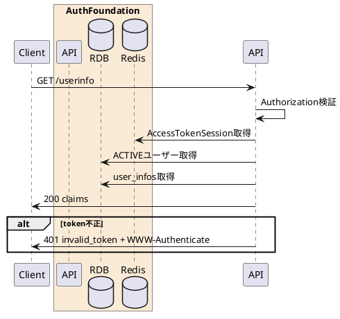

---

description: アクセストークンを検証してスコープに応じたユーザー情報を返却する

---

# UserInfo取得 <!-- omit in toc -->

## 1. API概要

OAuth 2.0 Bearerアクセストークンを検証し、OIDC UserInfo Endpointとしてユーザーのクレーム情報を返却する。

### 1.1. リクエスト

#### 1.1.1. エンドポイント

``` text
GET /userinfo
```

#### 1.1.2. リクエストヘッダ

| # | 物理名 | 論理名 | 型 | サイズ | 必須 | フォーマット | 補足事項 |
| --: | :-- | -- | -- | --: | :--: | -- | -- |
| 1. | Authorization | アクセストークン | string | - | ○ | `Bearer {access_token}` | - |

#### 1.1.3. リクエストパラメータ

なし

### 1.2. レスポンス

#### 1.2.1. レスポンスヘッダ

| # | 物理名 | 論理名 | 型 | サイズ | 必須 | フォーマット | 補足事項 |
| --: | :-- | -- | -- | --: | :--: | -- | -- |
| 1. | Content-Type | コンテンツタイプ | string | - | ○ | - | `application/json` |
| 2. | WWW-Authenticate | Bearerエラー | string | - | - | - | `invalid_token` の場合に返却 |
| 3. | Cache-Control | キャッシュ制御 | string | - | ○ | `no-store` | - |
| 4. | Pragma | キャッシュ制御 | string | - | ○ | `no-cache` | - |

#### 1.2.2. レスポンスパラメータ

| # | 物理名 | 論理名 | 型 | サイズ | 必須 | フォーマット | 補足事項 |
| --: | :-- | -- | -- | --: | :--: | -- | -- |
| 1. | sub | サブジェクト | string | 16 | ○ | `^[A-Fa-f0-9]{16}$` | Osolab ID |
| 2. | email | メールアドレス | string | - | - | email | `email` スコープがある場合のみ |
| 3. | email_verified | メール確認済み | boolean | - | - | - | `email` スコープがある場合のみ `true` |
| 4. | 任意claim | ユーザー拡張情報 | string | - | - | - | `user_infos` の有効データを `data_key` 名で返却 |

## 2. API詳細

### 2.1. 処理内容

| # | 処理概要 | 補足事項 |
| --: | -- | -- |
| 1. | Authorizationヘッダー確認 | Bearer形式であることを確認 |
| 2. | アクセストークン取得 | Redisのアクセストークンセッションを取得 |
| 3. | ユーザー取得 | ACTIVE状態のユーザーをRDBから取得 |
| 4. | スコープ判定 | `email` スコープがある場合のみメール関連claimを含める |
| 5. | 拡張claim取得 | `user_infos` の有効データをレスポンスに追加 |

### 2.2. シーケンス



### 2.3. エラーコード

| HTTPレスポンス | error | error_code | error_description |
| -- | -- | -- | -- |
| 400 | invalid_request | 00001 | リクエストパラメータエラー |
| 401 | invalid_token | 00008 | アクセストークンが無効です |
| 500 | server_error | 90000 | サーバーで予期しないエラーが発生しました |

## Review Clarifications

### Accepted principal type

`GET /userinfo` accepts only access tokens for a human user principal.
Tokens with `principal_type = ai_agent` are rejected with `401 invalid_token`.

AI agent identity is exposed through the agent ID token and agent-specific APIs, not through the OIDC UserInfo endpoint.

### Scope gated claims

The UserInfo response is limited by the access token scope.

| Claim | Condition |
| --- | --- |
| `sub` | Valid user access token with `openid` |
| `email` | `email` scope |
| `name` | `profile` scope |

If the token has `openid` only, the response contains `sub` only.
