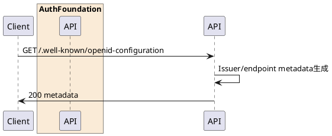

---

description: OpenID Connect Discovery メタデータを取得する

---

# OpenID Configuration取得 <!-- omit in toc -->

## 1. API概要

OIDC Discovery Endpointとして、Issuer、各エンドポイントURL、対応スコープ、署名アルゴリズム、PKCE方式を返却する。

### 1.1. リクエスト

#### 1.1.1. エンドポイント

``` text
GET /.well-known/openid-configuration
```

#### 1.1.2. リクエストヘッダ

なし

#### 1.1.3. リクエストパラメータ

なし

### 1.2. レスポンス

#### 1.2.1. レスポンスヘッダ

| # | 物理名 | 論理名 | 型 | サイズ | 必須 | フォーマット | 補足事項 |
| --: | :-- | -- | -- | --: | :--: | -- | -- |
| 1. | Content-Type | コンテンツタイプ | string | - | ○ | - | `application/json` |

#### 1.2.2. レスポンスパラメータ

| # | 物理名 | 論理名 | 型 | サイズ | 必須 | フォーマット | 補足事項 |
| --: | :-- | -- | -- | --: | :--: | -- | -- |
| 1. | issuer | Issuer | string | - | ○ | URI | `AppConfig.Issuer` |
| 2. | authorization_endpoint | 認可エンドポイント | string | - | ○ | URI | `{issuer}/authorize` |
| 3. | token_endpoint | トークンエンドポイント | string | - | ○ | URI | `{issuer}/token` |
| 4. | userinfo_endpoint | UserInfoエンドポイント | string | - | ○ | URI | `{issuer}/userinfo` |
| 5. | jwks_uri | JWKS URI | string | - | ○ | URI | `{issuer}/jwks` |
| 6. | response_types_supported | 対応response_type | array(string) | - | ○ | - | `code` |
| 7. | grant_types_supported | 対応grant_type | array(string) | - | ○ | - | `authorization_code` |
| 8. | subject_types_supported | 対応subject_type | array(string) | - | ○ | - | `public` |
| 9. | id_token_signing_alg_values_supported | IDトークン署名アルゴリズム | array(string) | - | ○ | - | `RS256` |
| 10. | token_endpoint_auth_methods_supported | トークンエンドポイント認証方式 | array(string) | - | ○ | - | `none`, `client_secret_basic` |
| 11. | scopes_supported | 対応スコープ | array(string) | - | ○ | - | `openid`, `email`, `profile` |
| 12. | claims_supported | 対応claim | array(string) | - | ○ | - | `sub`, `name`, `email`, `iss`, `aud`, `exp`, `iat`, `picture` |
| 13. | service_documentation | サービスドキュメントURL | string | - | ○ | URI | `AppConfig.ServiceDocumentationUrl` |
| 14. | code_challenge_methods_supported | 対応PKCE方式 | array(string) | - | ○ | - | `S256` |

## 2. API詳細

### 2.1. 処理内容

| # | 処理概要 | 補足事項 |
| --: | -- | -- |
| 1. | Issuer取得 | `AppConfig.Issuer` 末尾の `/` を除去 |
| 2. | エンドポイントURL生成 | Issuerを基準に認可、トークン、UserInfo、JWKS URLを生成 |
| 3. | メタデータ返却 | OIDC Discovery メタデータとしてJSON返却 |

### 2.2. シーケンス



### 2.3. エラーコード

なし
