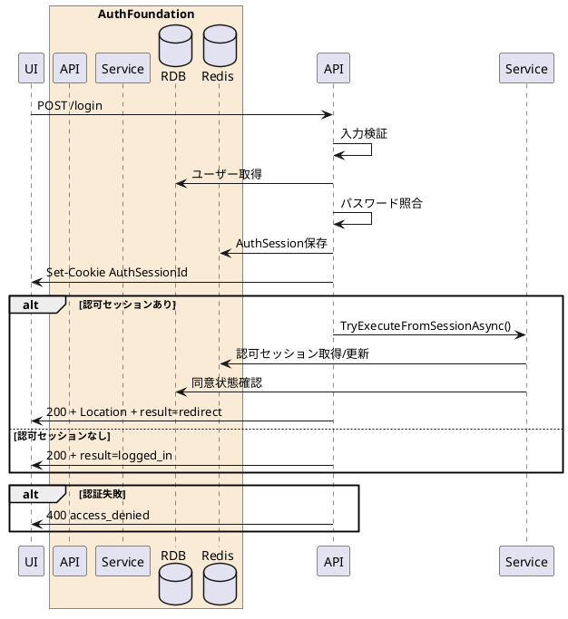

---

description: メールアドレスとパスワードでログインし認証セッションを作成する

---

# ログイン <!-- omit in toc -->

## 1. API概要

メールアドレスとパスワードを検証し、認証セッションCookieを発行する。認可セッションが有効な場合は認可処理を再開し、次の遷移先URLを返却する。

### 1.1. リクエスト

#### 1.1.1. エンドポイント

``` text
POST /login
```

#### 1.1.2. リクエストヘッダ

| # | 物理名 | 論理名 | 型 | サイズ | 必須 | フォーマット | 補足事項 |
| --: | :-- | -- | -- | --: | :--: | -- | -- |
| 1. | Content-Type | コンテンツタイプ | string | - | ○ | - | `application/x-www-form-urlencoded` |
| 2. | Cookie | 認可セッションCookie | string | - | - | - | `AuthRequestSessionId` または `session_id` |
| 3. | x-session-id | 認可セッションID | string | 32 | - | `^[A-Fa-f0-9]{32}$` | Cookieの代替 |

#### 1.1.3. リクエストパラメータ

| # | 物理名 | 論理名 | 型 | サイズ | 必須 | フォーマット | 補足事項 |
| --: | :-- | -- | -- | --: | :--: | -- | -- |
| 1. | session_id | 認可セッションID | string | 32 | - | `^[A-Fa-f0-9]{32}$` | Cookie/ヘッダー未指定時の代替 |
| 2. | email | メールアドレス | string | - | ○ | `^.+@.+$` | - |
| 3. | password | パスワード | string | 8-64 | ○ | 英大文字・英小文字・数字を各1文字以上 | - |

### 1.2. レスポンス

#### 1.2.1. レスポンスヘッダ

| # | 物理名 | 論理名 | 型 | サイズ | 必須 | フォーマット | 補足事項 |
| --: | :-- | -- | -- | --: | :--: | -- | -- |
| 1. | Set-Cookie | 認証セッションCookie | string | - | ○ | - | `AuthSessionId` を設定 |
| 2. | Location | 遷移先URL | string | - | - | URI | 認可処理を再開できた場合のみ |
| 3. | Cache-Control | キャッシュ制御 | string | - | ○ | `no-store` | - |
| 4. | Pragma | キャッシュ制御 | string | - | ○ | `no-cache` | - |

#### 1.2.2. レスポンスパラメータ

| # | 物理名 | 論理名 | 型 | サイズ | 必須 | フォーマット | 補足事項 |
| --: | :-- | -- | -- | --: | :--: | -- | -- |
| 1. | result | 処理結果 | string | - | ○ | `redirect` / `logged_in` | `logged_in` は認可セッションなしでログインのみ成功した場合 |
| 2. | response_code | レスポンスコード | string | 5 | ○ | `^[0-9]{5}$` | 正常時 `00000`、認可セッション切れ時 `00006` |
| 3. | message | メッセージ | string | - | ○ | - | - |
| 4. | authorization_code | 認可コード | string | - | - | - | 認可セッションを再開できた場合のみ返却。API Testerはこの値を `/token` の `code` に渡す |

#### 1.2.3. API Tester note

When `/login` resumes a valid authorization request session, the JSON body includes `authorization_code` in addition to the redirect URL/Location information.
Talend API Tester scenarios use this value directly:

```text
${"AuthFoundation - AuthorizationCodeFlow"."02. Login for authorize session"."response"."body"."authorization_code"}
```

## 2. API詳細

### 2.1. 処理内容

| # | 処理概要 | 補足事項 |
| --: | -- | -- |
| 1. | リクエストパラメータ確認 | Content-Type、メールアドレス、パスワード、任意の認可セッションIDを検証 |
| 2. | ユーザー認証 | `osolab_users` からACTIVEユーザーを取得し、パスワードハッシュを照合 |
| 3. | 認証セッション発行 | Redisへ認証セッションを保存し、`AuthSessionId` Cookieを設定 |
| 4. | 認可処理再開 | 認可セッションIDが存在する場合は認可処理を再実行 |
| 5. | 遷移先返却 | 認可処理を再開できた場合は `Location` と `result=redirect` を返却 |
| 6. | ログイン単体成功 | 認可セッションがない、または期限切れの場合は `result=logged_in` を返却 |

### 2.2. シーケンス



### 2.3. エラーコード

| HTTPレスポンス | error | error_code | error_description |
| -- | -- | -- | -- |
| 400 | invalid_request | 00001 | リクエストパラメータエラー |
| 400 | access_denied | 00004 | 認証に失敗しました |
| 500 | server_error | 90000 | サーバーで予期しないエラーが発生しました |
