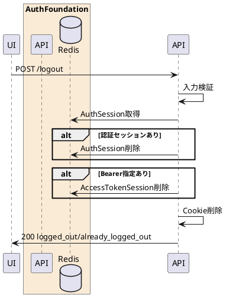

---

description: 認証セッションCookieと必要に応じてアクセストークンを削除する

---

# ログアウト <!-- omit in toc -->

## 1. API概要

認証セッションCookieを破棄し、Redis上の認証セッションを削除する。Bearerアクセストークンが指定された場合はアクセストークンセッションも削除する。

### 1.1. リクエスト

#### 1.1.1. エンドポイント

``` text
POST /logout
```

#### 1.1.2. リクエストヘッダ

| # | 物理名 | 論理名 | 型 | サイズ | 必須 | フォーマット | 補足事項 |
| --: | :-- | -- | -- | --: | :--: | -- | -- |
| 1. | Content-Type | コンテンツタイプ | string | - | - | - | 指定する場合は `application/x-www-form-urlencoded` |
| 2. | Cookie | セッションCookie | string | - | - | - | `AuthSessionId`、`AuthRequestSessionId`、`session_id` |
| 3. | Authorization | アクセストークン | string | - | - | `Bearer {access_token}` | 指定時はアクセストークンセッションも削除 |

#### 1.1.3. リクエストパラメータ

| # | 物理名 | 論理名 | 型 | サイズ | 必須 | フォーマット | 補足事項 |
| --: | :-- | -- | -- | --: | :--: | -- | -- |
| 1. | logout_all | 全端末ログアウト要求 | string | - | - | `^(true&#124;false)$` | 現行実装では入力検証しレスポンスへ返却。未指定時は `false` |

### 1.2. レスポンス

#### 1.2.1. レスポンスヘッダ

| # | 物理名 | 論理名 | 型 | サイズ | 必須 | フォーマット | 補足事項 |
| --: | :-- | -- | -- | --: | :--: | -- | -- |
| 1. | Set-Cookie | Cookie削除 | string | - | ○ | - | `AuthSessionId`、`AuthRequestSessionId`、`session_id` を期限切れにする |
| 2. | Cache-Control | キャッシュ制御 | string | - | ○ | `no-store` | - |
| 3. | Pragma | キャッシュ制御 | string | - | ○ | `no-cache` | - |

#### 1.2.2. レスポンスパラメータ

| # | 物理名 | 論理名 | 型 | サイズ | 必須 | フォーマット | 補足事項 |
| --: | :-- | -- | -- | --: | :--: | -- | -- |
| 1. | response_code | レスポンスコード | string | 5 | ○ | `^[0-9]{5}$` | 正常時 `00000` |
| 2. | result | 処理結果 | string | - | ○ | `logged_out` / `already_logged_out` | 有効な認証セッションがあった場合は `logged_out` |
| 3. | logout_all | 全端末ログアウト要求 | boolean | - | ○ | - | リクエスト値 |

## 2. API詳細

### 2.1. 処理内容

| # | 処理概要 | 補足事項 |
| --: | -- | -- |
| 1. | リクエストパラメータ確認 | Content-Typeと任意の `logout_all` を検証 |
| 2. | 認証セッション削除 | `AuthSessionId` Cookieがある場合、Redisの認証セッションを削除 |
| 3. | アクセストークン削除 | Authorization Bearerが指定された場合、Redisのアクセストークンセッションを削除 |
| 4. | Cookie削除 | `AuthSessionId`、`AuthRequestSessionId`、`session_id` を削除 |
| 5. | 結果返却 | セッション有無に応じて `logged_out` または `already_logged_out` を返却 |

### 2.2. シーケンス



### 2.3. エラーコード

| HTTPレスポンス | error | error_code | error_description |
| -- | -- | -- | -- |
| 400 | invalid_request | 00001 | リクエストパラメータエラー |
| 500 | server_error | 90000 | サーバーで予期しないエラーが発生しました |
