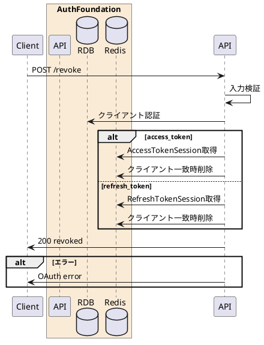

---

description: アクセストークンまたはリフレッシュトークンを失効する

---

# トークン失効 <!-- omit in toc -->

## 1. API概要

OAuth 2.0 Token Revocation Endpointとして、指定されたアクセストークンまたはリフレッシュトークンをRedisから削除する。トークンが存在しない場合も冪等に成功を返す。

### 1.1. リクエスト

#### 1.1.1. エンドポイント

``` text
POST /revoke
POST /api/auth/revoke
```

#### 1.1.2. リクエストヘッダ

| # | 物理名 | 論理名 | 型 | サイズ | 必須 | フォーマット | 補足事項 |
| --: | :-- | -- | -- | --: | :--: | -- | -- |
| 1. | Content-Type | コンテンツタイプ | string | - | ○ | - | `application/x-www-form-urlencoded` |
| 2. | Authorization | クライアントBasic認証 | string | - | - | `^Basic .+$` | Confidential clientの場合に指定 |

#### 1.1.3. リクエストパラメータ

| # | 物理名 | 論理名 | 型 | サイズ | 必須 | フォーマット | 補足事項 |
| --: | :-- | -- | -- | --: | :--: | -- | -- |
| 1. | token | 失効対象トークン | string | 20以上 | ○ | `^[A-Za-z0-9._~-]{20,}$` | - |
| 2. | token_type | トークン種別 | string | - | ○ | `^(access_token&#124;refresh_token)$` | 未指定時は `token_type_hint` を参照 |
| 3. | token_type_hint | トークン種別ヒント | string | - | - | `^(access_token&#124;refresh_token)$` | `token_type` の代替 |
| 4. | client_id | クライアントID | string | 32 | - | `^[0-9]{32}$` | Basic認証未指定時は必須 |

### 1.2. レスポンス

#### 1.2.1. レスポンスヘッダ

| # | 物理名 | 論理名 | 型 | サイズ | 必須 | フォーマット | 補足事項 |
| --: | :-- | -- | -- | --: | :--: | -- | -- |
| 1. | Content-Type | コンテンツタイプ | string | - | ○ | - | `application/json` |
| 2. | Cache-Control | キャッシュ制御 | string | - | ○ | `no-store` | - |
| 3. | Pragma | キャッシュ制御 | string | - | ○ | `no-cache` | - |

#### 1.2.2. レスポンスパラメータ

| # | 物理名 | 論理名 | 型 | サイズ | 必須 | フォーマット | 補足事項 |
| --: | :-- | -- | -- | --: | :--: | -- | -- |
| 1. | response_code | レスポンスコード | string | 5 | ○ | `^[0-9]{5}$` | 正常時 `00000` |
| 2. | result | 処理結果 | string | - | ○ | `revoked` | - |

## 2. API詳細

### 2.1. 処理内容

| # | 処理概要 | 補足事項 |
| --: | -- | -- |
| 1. | リクエストパラメータ確認 | Content-Type、token、token_type、クライアント認証情報を検証 |
| 2. | クライアント認証 | Basic認証または `client_id` を検証 |
| 3. | アクセストークン失効 | `token_type=access_token` の場合、クライアント一致時のみRedisから削除 |
| 4. | リフレッシュトークン失効 | `token_type=refresh_token` の場合、クライアント一致時のみRedisから削除 |
| 5. | 冪等応答 | トークン未存在、またはクライアント不一致の場合も成功として返却 |

### 2.2. シーケンス



### 2.3. エラーコード

| HTTPレスポンス | error | error_code | error_description |
| -- | -- | -- | -- |
| 400 | invalid_request | 00001 | リクエストパラメータエラー |
| 400 | invalid_client | 00002 | クライアント認証に失敗しました |
| 500 | server_error | 90000 | サーバーで予期しないエラーが発生しました |
