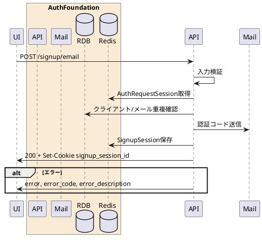

---

description: サインアップ用のメール認証コードを送信する

---

# サインアップメール送信 <!-- omit in toc -->

## 1. API概要

認可セッションに紐づいて登録対象メールアドレスを検証し、メール認証コードをGmail SMTPで送信する。認証コード検証用のサインアップセッションを発行する。

### 1.1. リクエスト

#### 1.1.1. エンドポイント

``` text
POST /signup/email
```

#### 1.1.2. リクエストヘッダ

| # | 物理名 | 論理名 | 型 | サイズ | 必須 | フォーマット | 補足事項 |
| --: | :-- | -- | -- | --: | :--: | -- | -- |
| 1. | Content-Type | コンテンツタイプ | string | - | ○ | - | `application/x-www-form-urlencoded` |
| 2. | Cookie | 認可セッションCookie | string | - | - | - | `AuthRequestSessionId` または `session_id` |
| 3. | x-session-id | 認可セッションID | string | 32 | - | `^[A-Fa-f0-9]{32}$` | Cookieの代替 |

#### 1.1.3. リクエストパラメータ

| # | 物理名 | 論理名 | 型 | サイズ | 必須 | フォーマット | 補足事項 |
| --: | :-- | -- | -- | --: | :--: | -- | -- |
| 1. | session_id | 認可セッションID | string | 32 | - | `^[A-Fa-f0-9]{32}$` | Cookie/ヘッダー未指定時の代替 |
| 2. | email | メールアドレス | string | - | ○ | `^.+@.+$` | 登録対象 |

### 1.2. レスポンス

#### 1.2.1. レスポンスヘッダ

| # | 物理名 | 論理名 | 型 | サイズ | 必須 | フォーマット | 補足事項 |
| --: | :-- | -- | -- | --: | :--: | -- | -- |
| 1. | Set-Cookie | サインアップセッションCookie | string | - | ○ | - | `signup_session_id` を設定 |
| 2. | Content-Type | コンテンツタイプ | string | - | ○ | - | `application/json` |

#### 1.2.2. レスポンスパラメータ

| # | 物理名 | 論理名 | 型 | サイズ | 必須 | フォーマット | 補足事項 |
| --: | :-- | -- | -- | --: | :--: | -- | -- |
| 1. | StatusCode | ステータスコード | string | 5 | ○ | `^[0-9]{5}$` | 正常時 `00000` |
| 2. | Message | メッセージ | string | - | ○ | - | 正常時は空文字 |

## 2. API詳細

### 2.1. 処理内容

| # | 処理概要 | 補足事項 |
| --: | -- | -- |
| 1. | リクエストパラメータ確認 | 認可セッションIDとメールアドレスを検証 |
| 2. | 認可セッション取得 | Redisから認可セッションを取得。存在しない場合は画面期限切れ |
| 3. | クライアント検証 | 認可セッションのクライアントIDを検証 |
| 4. | メールアドレス重複確認 | ACTIVEユーザーで同一メールアドレスが存在する場合はエラー |
| 5. | 認証コード送信 | 認証コードを生成しGmail SMTPで送信 |
| 6. | サインアップセッション作成 | `signup_session_id` と認証コードをRedisへ保存しCookieへ設定 |

### 2.2. シーケンス



### 2.3. エラーコード

| HTTPレスポンス | error | error_code | error_description |
| -- | -- | -- | -- |
| 400 | invalid_request | 00001 | リクエストパラメータエラー |
| 400 | invalid_client | 00002 | 不正なクライアント |
| 400 | invalid_request | 00003 | 画面の有効期限が切れました |
| 500 | server_error | 90000 | サーバーで予期しないエラーが発生しました |
