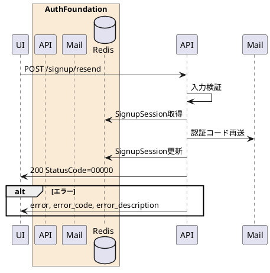

---

description: サインアップ用メール認証コードを再送する

---

# サインアップ認証コード再送 <!-- omit in toc -->

## 1. API概要

既存のサインアップセッションを用いて認証コードを再生成し、登録対象メールアドレスへ再送する。再送後は未検証状態に戻す。

### 1.1. リクエスト

#### 1.1.1. エンドポイント

``` text
POST /signup/resend
```

#### 1.1.2. リクエストヘッダ

| # | 物理名 | 論理名 | 型 | サイズ | 必須 | フォーマット | 補足事項 |
| --: | :-- | -- | -- | --: | :--: | -- | -- |
| 1. | Content-Type | コンテンツタイプ | string | - | ○ | - | `application/x-www-form-urlencoded` |
| 2. | Cookie | サインアップセッションCookie | string | - | - | - | `signup_session_id` |
| 3. | x-signup-session-id | サインアップセッションID | string | 32 | - | `^[A-Fa-f0-9]{32}$` | Cookieの代替 |

#### 1.1.3. リクエストパラメータ

| # | 物理名 | 論理名 | 型 | サイズ | 必須 | フォーマット | 補足事項 |
| --: | :-- | -- | -- | --: | :--: | -- | -- |
| 1. | signup_session_id | サインアップセッションID | string | 32 | - | `^[A-Fa-f0-9]{32}$` | Cookie/ヘッダー未指定時は必須 |

### 1.2. レスポンス

#### 1.2.1. レスポンスヘッダ

| # | 物理名 | 論理名 | 型 | サイズ | 必須 | フォーマット | 補足事項 |
| --: | :-- | -- | -- | --: | :--: | -- | -- |
| 1. | Content-Type | コンテンツタイプ | string | - | ○ | - | `application/json` |

#### 1.2.2. レスポンスパラメータ

| # | 物理名 | 論理名 | 型 | サイズ | 必須 | フォーマット | 補足事項 |
| --: | :-- | -- | -- | --: | :--: | -- | -- |
| 1. | StatusCode | ステータスコード | string | 5 | ○ | `^[0-9]{5}$` | 正常時 `00000` |
| 2. | Message | メッセージ | string | - | ○ | - | 正常時は空文字 |

## 2. API詳細

### 2.1. 処理内容

| # | 処理概要 | 補足事項 |
| --: | -- | -- |
| 1. | リクエストパラメータ確認 | サインアップセッションIDを検証 |
| 2. | サインアップセッション取得 | Redisからセッションを取得 |
| 3. | 認証コード再生成 | 既存メールアドレス宛てに新しい認証コードを送信 |
| 4. | 未検証状態へ更新 | `Verified=false` としてRedisへ保存 |

### 2.2. シーケンス



### 2.3. エラーコード

| HTTPレスポンス | error | error_code | error_description |
| -- | -- | -- | -- |
| 400 | invalid_request | 00001 | リクエストパラメータエラー |
| 500 | server_error | 90000 | サーバーで予期しないエラーが発生しました |
