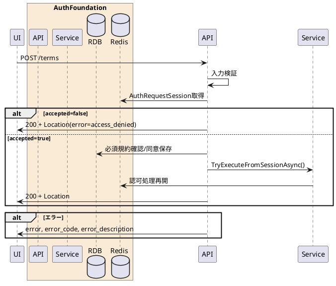

---

description: 規約とスコープの同意結果を保存して認可処理を再開する

---

# 規約同意 <!-- omit in toc -->

## 1. API概要

認可セッションに紐づく利用規約と要求スコープへの同意結果を登録し、認可処理を再開して次の遷移先を返却する。

### 1.1. リクエスト

#### 1.1.1. エンドポイント

``` text
POST /terms
```

#### 1.1.2. リクエストヘッダ

| # | 物理名 | 論理名 | 型 | サイズ | 必須 | フォーマット | 補足事項 |
| --: | :-- | -- | -- | --: | :--: | -- | -- |
| 1. | Content-Type | コンテンツタイプ | string | - | ○ | - | `application/x-www-form-urlencoded` |
| 2. | Cookie | 認可/認証セッションCookie | string | - | - | - | `AuthRequestSessionId`、`session_id`、`AuthSessionId` |
| 3. | x-session-id | 認可セッションID | string | 32 | - | `^[A-Fa-f0-9]{32}$` | Cookieの代替 |

#### 1.1.3. リクエストパラメータ

| # | 物理名 | 論理名 | 型 | サイズ | 必須 | フォーマット | 補足事項 |
| --: | :-- | -- | -- | --: | :--: | -- | -- |
| 1. | session_id | 認可セッションID | string | 32 | - | `^[A-Fa-f0-9]{32}$` | Cookie/ヘッダー未指定時の代替 |
| 2. | accepted | 同意結果 | string | - | ○ | `^(true&#124;false&#124;on)$` | `true` または `on` を同意扱い |
| 3. | term_ids | 同意規約ID | array(string) | - | - | - | 複数指定時は同名項目を繰り返す |

### 1.2. レスポンス

#### 1.2.1. レスポンスヘッダ

| # | 物理名 | 論理名 | 型 | サイズ | 必須 | フォーマット | 補足事項 |
| --: | :-- | -- | -- | --: | :--: | -- | -- |
| 1. | Location | 遷移先URL | string | - | ○ | URI | 同意時は `code` と `state`、拒否時は `error=access_denied` と `state` を付与 |
| 2. | Cache-Control | キャッシュ制御 | string | - | ○ | `no-store` | - |
| 3. | Pragma | キャッシュ制御 | string | - | ○ | `no-cache` | - |

#### 1.2.2. レスポンスパラメータ

| # | 物理名 | 論理名 | 型 | サイズ | 必須 | フォーマット | 補足事項 |
| --: | :-- | -- | -- | --: | :--: | -- | -- |
| 1. | result | 処理結果 | string | - | ○ | `redirect` | - |
| 2. | error | OAuthエラー | string | - | - | `access_denied` | 同意拒否時のみ |

## 2. API詳細

### 2.1. 処理内容

| # | 処理概要 | 補足事項 |
| --: | -- | -- |
| 1. | リクエストパラメータ確認 | セッションID、同意結果を検証 |
| 2. | 認可セッション取得 | Redisから認可セッションを取得。存在しない場合は画面期限切れ |
| 3. | 拒否処理 | `accepted=false` の場合、`redirect_uri` に `error=access_denied` と `state` を付与 |
| 4. | 必須規約確認 | 必須規約がすべて `term_ids` に含まれていることを確認 |
| 5. | 同意保存 | 規約同意履歴とスコープ同意情報を保存 |
| 6. | 認可再実行 | 認証セッションを用いて認可処理を再開し、認可コードまたは次画面URLを返却 |

### 2.2. シーケンス



### 2.3. エラーコード

| HTTPレスポンス | error | error_code | error_description |
| -- | -- | -- | -- |
| 400 | invalid_request | 00001 | リクエストパラメータエラー |
| 400 | invalid_request | 00003 | 画面の有効期限が切れました |
| 500 | server_error | 90000 | サーバーで予期しないエラーが発生しました |
