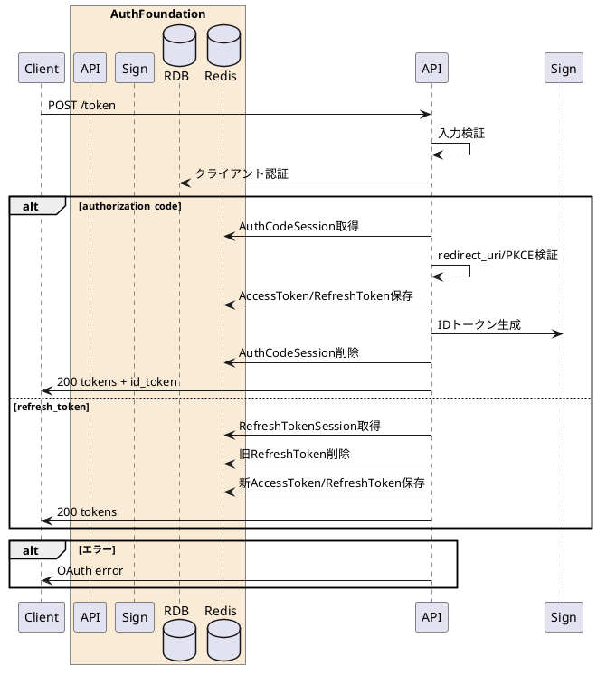

---

description: 認可コードまたはリフレッシュトークンを検証してトークンを発行する

---

# トークン発行 <!-- omit in toc -->

## 1. API概要

OAuth 2.0 Token Endpointとして、認可コードグラントまたはリフレッシュトークングラントを処理し、アクセストークン、リフレッシュトークン、IDトークンを発行する。

### 1.1. リクエスト

#### 1.1.1. エンドポイント

``` text
POST /token
POST /api/auth/token
```

#### 1.1.2. リクエストヘッダ

| # | 物理名 | 論理名 | 型 | サイズ | 必須 | フォーマット | 補足事項 |
| --: | :-- | -- | -- | --: | :--: | -- | -- |
| 1. | Content-Type | コンテンツタイプ | string | - | ○ | - | `application/x-www-form-urlencoded` |
| 2. | x-flow-type | フロー種別 | string | 17 | ○ | `^AuthorizationCode$` | Authorization Code Flow固定 |
| 3. | Authorization | クライアントBasic認証 | string | - | - | `^Basic .+$` | Confidential clientの場合に指定。`Base64(client_id:client_secret)` |

#### 1.1.3. リクエストパラメータ

| # | 物理名 | 論理名 | 型 | サイズ | 必須 | フォーマット | 補足事項 |
| --: | :-- | -- | -- | --: | :--: | -- | -- |
| 1. | grant_type | グラント種別 | string | - | ○ | `^(authorization_code&#124;refresh_token)$` | - |
| 2. | client_id | クライアントID | string | 32 | - | `^[0-9]{32}$` | Basic認証未指定時は必須 |
| 3. | code | 認可コード | string | 20以上 | - | `^[A-Za-z0-9._~-]{20,}$` | `grant_type=authorization_code` の場合は必須 |
| 4. | code_verifier | PKCE verifier | string | 43-128 | - | `^[A-Za-z0-9._~-]{43,128}$` | `grant_type=authorization_code` の場合は必須 |
| 5. | redirect_uri | リダイレクトURI | string | - | - | `https://...` または許可済みローカルHTTP | `grant_type=authorization_code` の場合は必須。認可要求時と完全一致 |
| 6. | refresh_token | リフレッシュトークン | string | 20以上 | - | `^[A-Za-z0-9._~-]{20,}$` | `grant_type=refresh_token` の場合は必須 |

### 1.2. レスポンス

#### 1.2.1. レスポンスヘッダ

| # | 物理名 | 論理名 | 型 | サイズ | 必須 | フォーマット | 補足事項 |
| --: | :-- | -- | -- | --: | :--: | -- | -- |
| 1. | Content-Type | コンテンツタイプ | string | - | ○ | - | `application/json` |
| 2. | Cache-Control | キャッシュ制御 | string | - | ○ | `no-store` | - |
| 3. | Pragma | キャッシュ制御 | string | - | ○ | `no-cache` | - |

#### 1.2.2. レスポンスパラメータ

| # | 物理名 | 論理名 | 型 | サイズ | 必須 | フォーマット | 補足事項 |
| --: | :-- | -- | -- | --: | :--: | -- | -- |
| 1. | response_code | レスポンスコード | string | 5 | ○ | `^[0-9]{5}$` | 正常時 `00000` |
| 2. | access_token | アクセストークン | string | - | ○ | `^[A-Fa-f0-9]{16}_[A-Fa-f0-9]{32}_[0-9]{32}$` | - |
| 3. | refresh_token | リフレッシュトークン | string | - | ○ | `^[A-Fa-f0-9]{16}_[A-Fa-f0-9]{32}_[0-9]{32}$` | - |
| 4. | token_type | トークン種別 | string | 6 | ○ | `Bearer` | - |
| 5. | expires_in | アクセストークン有効期限 | number | - | ○ | - | 秒 |
| 6. | refresh_token_expires_in | リフレッシュトークン有効期限 | number | - | ○ | - | 秒 |
| 7. | scope | 発行スコープ | string | - | ○ | - | 空白区切り |
| 8. | id_token | IDトークン | string | - | - | JWT | `grant_type=authorization_code` の場合に返却 |

## 2. API詳細

### 2.1. 処理内容

| # | 処理概要 | 補足事項 |
| --: | -- | -- |
| 1. | リクエストパラメータ確認 | Content-Type、フロー種別、grant_type、各grant必須項目を検証 |
| 2. | クライアント認証 | Basic認証または `client_id` を検証 |
| 3. | 認可コード検証 | 認可コード、クライアントID、redirect_uri、PKCEを検証 |
| 4. | リフレッシュトークン検証 | リフレッシュトークンとクライアントIDを検証 |
| 5. | トークン発行 | アクセストークンとリフレッシュトークンをRedisへ保存 |
| 6. | IDトークン発行 | 認可コードグラントの場合、RS256署名付きIDトークンを発行 |
| 7. | ローテーション | リフレッシュトークングラントの場合、旧リフレッシュトークンを削除 |

### 2.2. シーケンス



### 2.3. エラーコード

| HTTPレスポンス | error | error_code | error_description |
| -- | -- | -- | -- |
| 400 | invalid_request | 00001 | リクエストパラメータエラー |
| 400 | invalid_client | 00002 | クライアント認証に失敗しました |
| 400 | invalid_grant | 00005 | リダイレクトURIが不正 |
| 400 | invalid_grant | 00007 | grantが無効です |
| 500 | server_error | 90000 | サーバーで予期しないエラーが発生しました |
