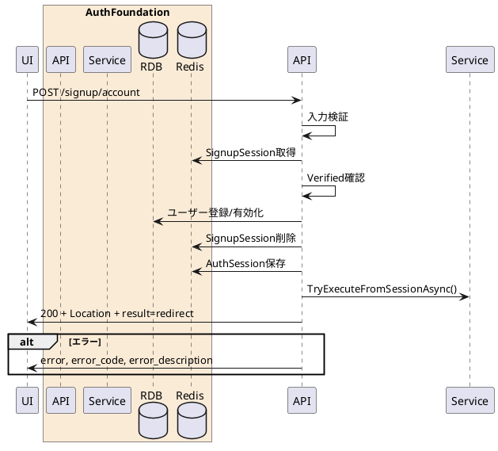

---

description: メール認証済みサインアップセッションからアカウントを作成する

---

# サインアップ本登録 <!-- omit in toc -->

## 1. API概要

メール認証済みのサインアップセッションを用いてユーザーを作成または有効化し、認証セッションを発行する。その後、認可処理を再開して次の遷移先URLを返却する。

### 1.1. リクエスト

#### 1.1.1. エンドポイント

``` text
POST /signup/account
```

#### 1.1.2. リクエストヘッダ

| # | 物理名 | 論理名 | 型 | サイズ | 必須 | フォーマット | 補足事項 |
| --: | :-- | -- | -- | --: | :--: | -- | -- |
| 1. | Content-Type | コンテンツタイプ | string | - | ○ | - | `application/x-www-form-urlencoded` |
| 2. | Cookie | サインアップセッションCookie | string | - | - | - | `signup_session_id` |
| 3. | x-signup-session-id | サインアップセッションID | string | 32 | - | `^[A-Fa-f0-9]{32}$` | Cookieの代替 |

#### 1.1.3. リクエストパラメータ

| # | 物理名 | 論理名 | 型 | サイズ | 必須 | フォーマット | 補足事項 |
| --: | :-- | -- | -- | --: | :--: | -- | -- |
| 1. | signup_session_id | サインアップセッションID | string | 32 | - | `^[A-Fa-f0-9]{32}$` | Cookie/ヘッダー未指定時は必須 |
| 2. | password | パスワード | string | 8-64 | ○ | 英大文字・英小文字・数字を各1文字以上 | - |

### 1.2. レスポンス

#### 1.2.1. レスポンスヘッダ

| # | 物理名 | 論理名 | 型 | サイズ | 必須 | フォーマット | 補足事項 |
| --: | :-- | -- | -- | --: | :--: | -- | -- |
| 1. | Set-Cookie | 認証セッションCookie | string | - | ○ | - | `AuthSessionId` を設定 |
| 2. | Location | 遷移先URL | string | - | ○ | URI | 認可処理再開後の遷移先 |
| 3. | Content-Type | コンテンツタイプ | string | - | ○ | - | `application/json` |

#### 1.2.2. レスポンスパラメータ

| # | 物理名 | 論理名 | 型 | サイズ | 必須 | フォーマット | 補足事項 |
| --: | :-- | -- | -- | --: | :--: | -- | -- |
| 1. | result | 処理結果 | string | - | ○ | `redirect` | - |
| 2. | response_code | レスポンスコード | string | 5 | ○ | `^[0-9]{5}$` | 正常時 `00000` |
| 3. | message | メッセージ | string | - | ○ | - | 正常時は空文字 |

## 2. API詳細

### 2.1. 処理内容

| # | 処理概要 | 補足事項 |
| --: | -- | -- |
| 1. | リクエストパラメータ確認 | サインアップセッションIDとパスワードを検証 |
| 2. | サインアップセッション取得 | Redisからセッションを取得 |
| 3. | メール認証済み確認 | `Verified=true` でない場合はエラー |
| 4. | ユーザー登録/有効化 | 新規ユーザーを作成、または仮登録ユーザーを有効化 |
| 5. | サインアップセッション削除 | 本登録完了後にRedisから削除 |
| 6. | 認証セッション発行 | Redisへ認証セッションを保存し、`AuthSessionId` Cookieを設定 |
| 7. | 認可処理再開 | 元の認可セッションから認可処理を再開し、遷移先URLを返却 |

### 2.2. シーケンス



### 2.3. エラーコード

| HTTPレスポンス | error | error_code | error_description |
| -- | -- | -- | -- |
| 400 | invalid_request | 00001 | リクエストパラメータエラー |
| 400 | invalid_request | 00003 | 画面の有効期限が切れました |
| 500 | server_error | 90000 | サーバーで予期しないエラーが発生しました |
