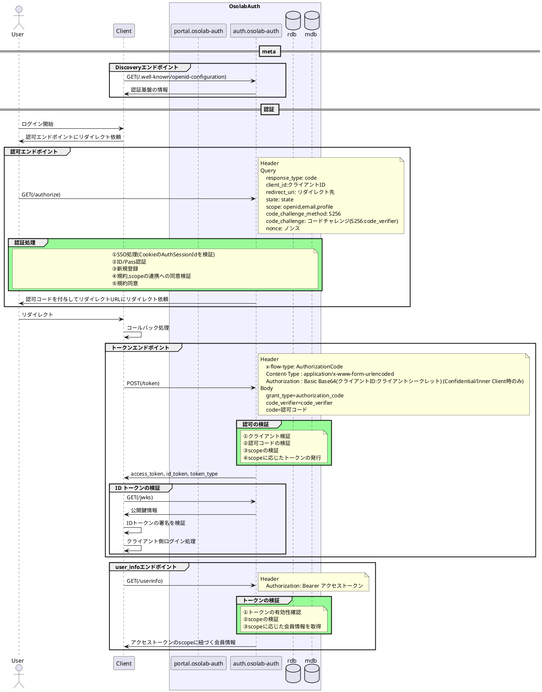

# 認証フロー(省略版)

## ■ フロー概要
Authorization Code Flow

## ■ シーケンス

```plantuml
@startuml
actor User
participant Client
box OsolabAuth #0000ff0f
    participant "portal.osolab-auth" as portal
    participant "auth.osolab-auth" as auth
    database rdb
    database mdb
end box
== meta ==
group Discoveryエンドポイント
    Client -> auth : GET(/.well-known/openid-configuration)
    Client <- auth : 認証基盤の情報
end

== 認証 ==
User -> Client : ログイン開始
User <- Client : 認可エンドポイントにリダイレクト依頼
group 認可エンドポイント
    User -> auth : GET(/authorize)
    note right
        Header
        Query
            response_type: code
            client_id:クライアントID
            redirect_uri: リダイレクト先
            state: state
            scope: openid,email,profile
            code_challenge_method: S256
            code_challenge: コードチャレンジ(S256:code_verifier)
            nonce: ノンス
    end note
    
    group #PaleGreen 認証処理 
        note over User,mdb
            ①SSO処理(CookieのAuthSessionIdを検証)
            ②ID/Pass認証
            ③新規登録
            ④規約,scopeの連携への同意検証
            ⑤規約同意
        end note
    end


    User <- auth : 認可コードを付与してリダイレクトURLにリダイレクト依頼
end
User -> Client :リダイレクト
Client -> Client : コールバック処理

group トークンエンドポイント
    Client -> auth : POST(/token)
    note right
        Header
            x-flow-type: AuthorizationCode
            Content-Type : application/x-www-form-urlencoded
            Authorization : Basic Base64(クライアントID:クライアントシークレット) (Confidential/Inner Client時のみ)
        Body
            grant_type=authorization_code
            code_verifier=code_verifier
            code=認可コード
    end note
    group #PaleGreen 認可の検証 
        note over auth,mdb
            ①クライアント検証
            ②認可コードの検証
            ③scopeの検証
            ④scopeに応じたトークンの発行
        end note
    end
    
    Client <- auth : access_token, id_token, token_type
    group ID トークンの検証
        Client -> auth : GET(/jwks)
        Client <- auth : 公開鍵情報
        Client -> Client : IDトークンの署名を検証
        Client -> Client : クライアント側ログイン処理
    end
end
group user_infoエンドポイント
    Client -> auth : GET(/userinfo)
    note right
        Header
            Authorization: Bearer アクセストークン
    end note
    group #PaleGreen トークンの検証 
        note over auth,mdb
            ①トークンの有効性確認
            ②scopeの検証
            ③scopeに応じた会員情報を取得
        end note
    end
    Client <- auth : アクセストークンのscopeに紐づく会員情報
end
@enduml
```

## ■ ステップ
1. 認可リクエスト
2. 認証
3. 認可コード発行
4. トークン交換

## ■ 補足
- stateでCSRF対策
- PKCE必須
