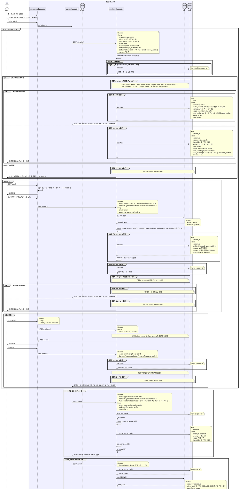

# 認証フロー(ポータルサイト)

## ■ フロー概要
Authorization Code Flow(ポータルサイト用)

## ■ シーケンス

```plantuml
@startuml
actor User
box OsolabAuth #0000ff0f
    participant "portal.osolab-auth" as portal
    participant "api.osolab-auth" as bff
    database bffdb
    participant "auth.osolab-auth" as auth
    database rdb
    database mdb
end box
User -> portal : ポータルサイトを開く
User <- portal : ポータルサイトとログインボタンを表示
User -> portal : ログイン開始
portal -> bff : GET(/login)
group 認可エンドポイント

    bff -> auth : GET(/authorize)
    note right
        Header
        Query
            response_type: code
            client_id:クライアントID
            redirect_uri: リダイレクト先
            state: state
            scope: openid,email,profile
            code_challenge_method: S256
            code_challenge: コードチャレンジ(S256:code_verifier)
            nonce: ノンス
    end note
    auth -> auth : CookieからセッションIDを取得
    group ログイン済み確認
        opt Cookie.session_idが存在する場合
            auth -> mdb : Get:DB1 
            note right
                key: Cookie.session_id 
            end note 
            auth <-- mdb : ログンセッション情報
        end
    end

    alt ログイン済みの場合
        group 規約、scopeへの同意チェック
            note over auth,rdb
                RDBにclient_terms と user_terms, client_scopes, user_client_scopesを追加して
                すべての規約、スコープに同意していることを確認する処理を追加
            end note 
        end
        alt 規約同意済みの場合
            group 認可コードの発行
                auth -> mdb : Set:DB2
                note right 
                    Key
                        code
                    Value
                        code: 認可コード
                        osolab_id: ログインセッション情報.osolab_id
                        redirect_uri: リダイレクト先
                        scope: openid,email,profile
                        code_challenge: コードチャレンジ(S256:code_verifier)
                        nonce: ノンス
                        state: state
                end note
                auth <-- mdb
            end

            bff <- auth : 認可コードを付与してリダイレクトURLにリダイレクト依頼
        else
            group 認可セッション発行
                auth -> mdb : Set:DB6
                note right 
                    Key
                        session_id
                    Value
                        session_id
                        response_type: code
                        client_id:クライアントID
                        redirect_uri: リダイレクト先
                        state: state
                        scope: openid,email,profile
                        code_challenge_method: S256
                        code_challenge: コードチャレンジ(S256:code_verifier)
                        nonce: ノンス
                end note
                auth <-- mdb
            end
            User <- auth : 同意画面にリダイレクト依頼
        end
    else 未ログインの場合
        group 認可セッション発行
            note over auth,mdb 
                「認可セッション発行」参照
            end note
        end
        User <- auth : ログイン画面にリダイレクト依頼(認可セッションID)
    end

    group ログイン
        User -> portal : GET(/login)
        portal -> portal : 認可セッションIDをローカルストレージに保存
        User <- portal : 認証画面
        User -> portal : ID/パスワードを入力(ハッシュ化)
        portal -> auth : POST(/login)
        note right
            Header
                x-session-id : ローカルストレージ.認可セッションID
                Content-Type : application/x-www-form-urlencoded
            Body
                email=email
                password=passwordハッシュ
        end note
        auth -> rdb : ユーザー取得
        auth <-- rdb : osolab_user
        note right 
            WHERE
                email = email
                status = 1(active)
        end note
        auth -> auth : HMAC-S256(passwordハッシュ+osolab_user.salt,key)とosolab_user.passhashの一致チェック
        group ログインセッション登録
            auth -> mdb : Set:DB1
            note right 
                Key
                    session_id
                Value
                    session_id
                    osolab_id: osolab_user.osolab_id
                    created_at: 現在時刻
                    expires_at:現在時刻 + 2592000
                    latest_auth_at: 現在時刻
            end note
            auth <-- mdb
            auth -> auth: Cookieにセッションを登録
        end
        group 認可セッション取得
            auth -> mdb : Get:DB6 
            note right
                key: x-session-id
            end note 
            auth <-- mdb : 認可セッション情報
        end

        group 規約、scopeへの同意チェック
            note over auth,rdb
                「規約、scopeへの同意チェック」参照
            end note 
        end
        alt 規約同意済みの場合
            group 認可コードの発行
                note over auth,mdb
                    「認可コードの発行」参照
                end note
            end

            bff <- auth : 認可コードを付与してリダイレクトURLにリダイレクト依頼
        else
            group 認可セッション発行
                note over auth,mdb
                    「認可セッション発行」参照
                end note
            end
            User <- auth : 同意画面にリダイレクト依頼
        end
        
    end
    group 規約同意
        User -> portal : GET(/terms)
        note right
            Header
            Query
                client_id:クライアントID
        end note
        portal -> auth : GET(client/terms)
        note right
            Header
            Query
                client_id:クライアントID
        end note
        note over auth,rdb
            RDBにclient_terms と client_scopesを取得する処理
        end note 
        portal <- auth : 規約,スコープ
        User <- portal : 規約画面
        User -> portal : 同意操作
        portal -> auth : POST(/terms)
        note right
            Header
                x-session-id : 認可セッションID
                Content-Type : application/x-www-form-urlencoded
        end note
        group 認可セッション取得
            auth -> mdb : Get:DB6 
            note right
                key: x-session-id
            end note 
            auth <-- mdb : 認可セッション情報
        end
        note over auth,rdb
            最新の規約情報で同意情報を登録
        end note

        group 認可コードの発行
            note over auth,mdb
                「認可コードの発行」参照
            end note
        end

        bff <- auth : 認可コードを付与してリダイレクトURLにリダイレクト依頼
    end
end
group トークンエンドポイント
    bff -> auth : POST(/token)
    note right
        Header
            x-flow-type: AuthorizationCode
            Content-Type : application/x-www-form-urlencoded
            Authorization : Basic Base64(クライアントID:クライアントシークレット)
        Body
            grant_type=authorization_code
            code_verifier=code_verifier
            code=認可コード
    end note
    auth -> mdb : 認可コード取得
    note right 
        Key : 認可コード
    end note
    auth <-- mdb : code情報
    auth -> auth : client_id / code_verifier検証
    auth -> mdb : アクセストークン登録
    note right 
        Key
            token-id
        Value
            token_id: token-id
            user_id: osolab_id
            scope: スコープ
            client_id:クライアントID
    end note
    auth -> auth : access_token発行
    auth -> auth : id_token発行
    bff <- auth : access_token, id_token, token_type
end

group user_infoエンドポイント
    bff -> auth : GET(/userinfo)
    note right
        Header
            Authorization: Bearer アクセストークン
    end note
    auth -> mdb : アクセストークン取得
    note right 
        Key token-id
    end note
    auth <-- mdb : トークン情報
    auth -> rdb : user情報取得
    auth <-- rdb : user_info
    note right 
        WHERE
            user_id = osolab_id
            client_id: クライアントID or 00..00(共通クライアント)
            data_key in scope
    end note
    bff <- auth : アクセストークンのscopeに紐づく会員情報
end
@enduml
```

## ■ ステップ
1. 認可リクエスト
2. 認証
3. 認可コード発行
4. トークン交換

## ■ 補足
- stateでCSRF対策
- PKCE必須
