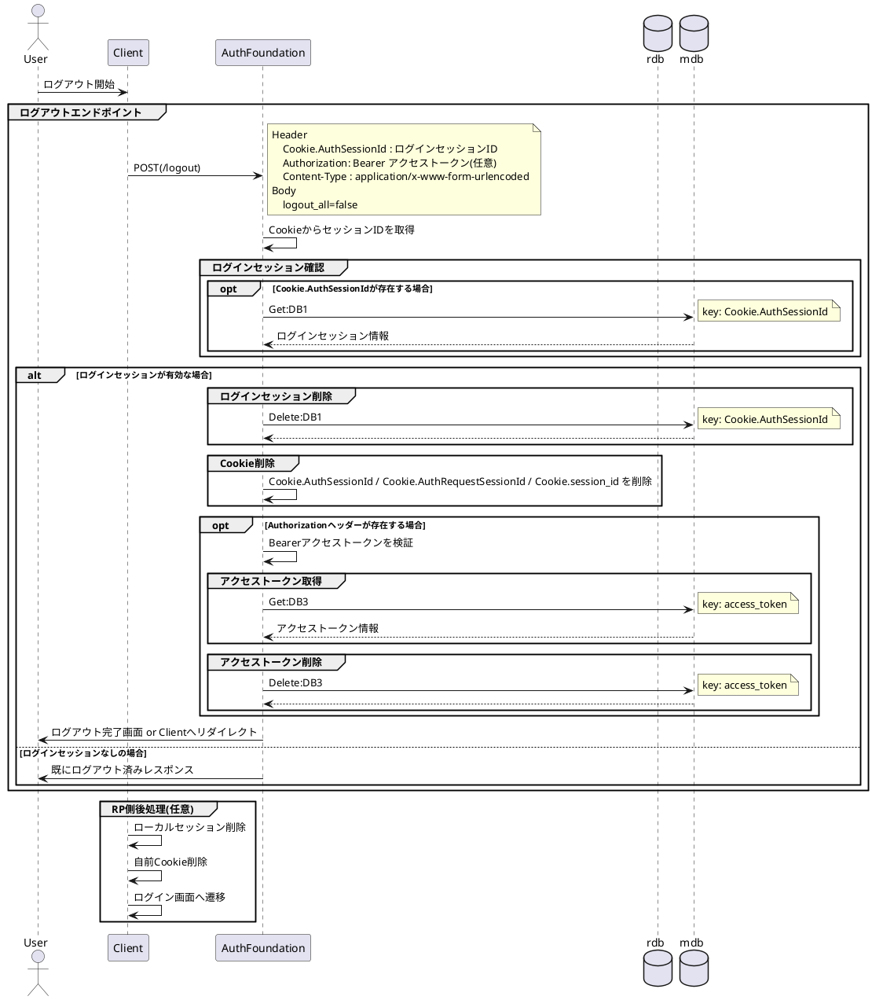

# ログアウトフロー

## ■ フロー概要
Auth Session / Access Token失効フロー

## ■ シーケンス

```plantuml
@startuml
actor User
participant Client
participant "AuthFoundation" as auth
database rdb
database mdb

User -> Client : ログアウト開始

group ログアウトエンドポイント
    Client -> auth : POST(/logout)
    note right
        Header
            Cookie.AuthSessionId : ログインセッションID
            Authorization: Bearer アクセストークン(任意)
            Content-Type : application/x-www-form-urlencoded
        Body
            logout_all=false
    end note

    auth -> auth : CookieからセッションIDを取得

    group ログインセッション確認
        opt Cookie.AuthSessionIdが存在する場合
            auth -> mdb : Get:DB1
            note right
                key: Cookie.AuthSessionId
            end note
            auth <-- mdb : ログインセッション情報
        end
    end

    alt ログインセッションが有効な場合

        group ログインセッション削除
            auth -> mdb : Delete:DB1
            note right
                key: Cookie.AuthSessionId
            end note
            auth <-- mdb
        end

        group Cookie削除
            auth -> auth : Cookie.AuthSessionId / Cookie.AuthRequestSessionId / Cookie.session_id を削除
        end

        opt Authorizationヘッダーが存在する場合
            auth -> auth : Bearerアクセストークンを検証

            group アクセストークン取得
                auth -> mdb : Get:DB3
                note right
                    key: access_token
                end note
                auth <-- mdb : アクセストークン情報
            end

            group アクセストークン削除
                auth -> mdb : Delete:DB3
                note right
                    key: access_token
                end note
                auth <-- mdb
            end
        end

        User <- auth : ログアウト完了画面 or Clientへリダイレクト

    else ログインセッションなしの場合

        User <- auth : 既にログアウト済みレスポンス

    end

end

group RP側後処理(任意)
    Client -> Client : ローカルセッション削除
    Client -> Client : 自前Cookie削除
    Client -> Client : ログイン画面へ遷移
end

@enduml
```
