# アカウント登録フロー

## ■ フロー概要
Authorization Code Flow中のアカウント登録フロー

> 注意: 本書は旧仕様ベースの詳細検討ログです。現行実装とは差分があるため、実装判断には使用しないでください。実装準拠フローは `Architecture/AuthFlow/SignupSimple.md` と `API` 配下の各仕様書を正としてください。

## ■ シーケンス

```plantuml
@startuml
actor User
participant Client
box OsolabAuth #0000ff0f
    participant "portal.osolab-auth" as portal
    participant "auth.osolab-auth" as auth
    database rdb
    database mdb
end box
participant "MailProvider" as mail

User -> Client : ログイン開始
group 認可エンドポイント
    Client -> auth : GET(/authorize)
    note right
        Header
        Query
            response_type: code
            client_id:クライアントID
            redirect_uri: リダイレクト先
            state: state
            scope: openid,email,profile
            code_challenge_method: S256
            code_challenge: コードチャレンジ(S256:code_verifier)
            nonce: ノンス
    end note

    group 認可セッション発行
        auth -> mdb : Set:DB6
        note right
            Key
                auth_request_session_id
            Value
                auth_request_session_id
                response_type: code
                client_id:クライアントID
                redirect_uri: リダイレクト先
                state: state
                scope: openid,email,profile
                code_challenge_method: S256
                code_challenge: コードチャレンジ(S256:code_verifier)
                nonce: ノンス
        end note
        auth <-- mdb
    end

    User <- auth : ログイン画面に遷移依頼
    note right
        Portal UI方式ではAuthRequestSessionIdをURL queryに付与しない。
        /authorizeのSet-Cookieで付与し、Portal UIはCookieで保持する。
    end note
end

group アカウント登録
    User -> portal : GET(/login/)
    User <- portal : ログイン画面
    User -> portal : 新規登録リンクをクリック
    User <-- portal
    User -> portal : GET(/Signup/)
    User <- portal : アカウント登録画面

    User -> User : email/passwordを入力(ハッシュ化)
    User -> auth : POST(/signup/account)
    note right
        Header
            Cookie : AuthRequestSessionId=認可セッションID(互換でsession_idも可)
            Content-Type : application/x-www-form-urlencoded
        Body
            email=email
            password=パスワード平文(TLS上で送信)
    end note

    group 認可セッション取得
        auth -> mdb : Get:DB6
        note right
            key: Cookie.AuthRequestSessionId(互換: Cookie.session_id)
        end note
        auth <-- mdb : 認可セッション情報
    end

    auth -> rdb : クライアント取得
    auth <-- rdb : client_master
    note right
        WHERE
            client_id = 認可セッション情報.client_id
            status = 1(active)
    end note

    auth -> rdb : email重複チェック
    auth <-- rdb : osolab_user
    note right
        WHERE
            email = email
            status in 仮登録/有効
    end note

    alt email使用済みの場合
        User <- auth : アカウント登録画面にエラー表示
    else 登録可能の場合
        auth -> rdb : 仮ユーザー登録
        note right
            INSERT
                email
                passhash
                salt
                status = provisional
                create_datetime
                update_datetime
        end note
        auth <-- rdb : osolab_user

        group メール認証セッション発行
            auth -> mdb : Set:DB7
            note right
                Key
                    verification_token
                Value
                    verification_token
                    osolab_id: osolab_user.osolab_id
                    email: email
                    auth_request_session_id: 認可セッションID
                    created_at: 現在時刻
                    expires_at: 現在時刻 + 1800
            end note
            auth <-- mdb
        end

        auth -> mail : 認証メール送信
        note right
            To
                email
            Body
                /signup/verify?token=verification_token
        end note
        auth <-- mail

        User <- auth : verifyUrlを返却
    end
end

group メール認証
    User -> auth : GET(/Signup/Verify)
    note right
        Query
            token: verification_token
    end note

    group メール認証セッション取得
        auth -> mdb : Get:DB7
        note right
            key: verification_token
        end note
        auth <-- mdb : メール認証セッション情報
    end

    auth -> rdb : 仮ユーザー取得
    auth <-- rdb : osolab_user
    note right
        WHERE
            osolab_id = メール認証セッション情報.osolab_id
            status = provisional
    end note

    auth -> rdb : ユーザー有効化
    note right
        UPDATE
            status = active
            update_datetime = 現在時刻
    end note
    auth <-- rdb

    auth -> mdb : Delete:DB7
    note right
        key: verification_token
    end note
    auth <-- mdb

    group ログインセッション登録
        auth -> mdb : Set:DB1
        note right
            Key
                session_id
            Value
                session_id
                osolab_id: osolab_user.osolab_id
                created_at: 現在時刻
                expires_at: 現在時刻 + 2592000
                latest_auth_at: 現在時刻
        end note
        auth <-- mdb
        auth -> auth : Cookieにセッションを登録
    end

    group 認可セッション取得
        auth -> mdb : Get:DB6
        note right
            key: メール認証セッション情報.auth_request_session_id
        end note
        auth <-- mdb : 認可セッション情報
    end

    group 規約、scopeへの同意チェック
        note over auth,rdb
            RDBにclient_terms と user_terms, client_scopes, user_client_scopesを追加して
            すべての規約、スコープに同意していることを確認する処理を追加
        end note
    end

    alt 規約同意済みの場合
        group 認可コードの発行
            auth -> mdb : Set:DB2
            note right
                Key
                    code
                Value
                    code: 認可コード
                    osolab_id: osolab_user.osolab_id
                    redirect_uri: 認可セッション情報.redirect_uri
                    scope: 認可セッション情報.scope
                    code_challenge: 認可セッション情報.code_challenge
                    nonce: 認可セッション情報.nonce
                    state: 認可セッション情報.state
            end note
            auth <-- mdb
        end

        User <- auth : /authorize へリダイレクト
        Client <- auth : 認可コードを付与してredirect_uriへリダイレクト依頼
    else
        User <- auth : /terms/view にリダイレクト依頼
    end
end

@enduml
```

