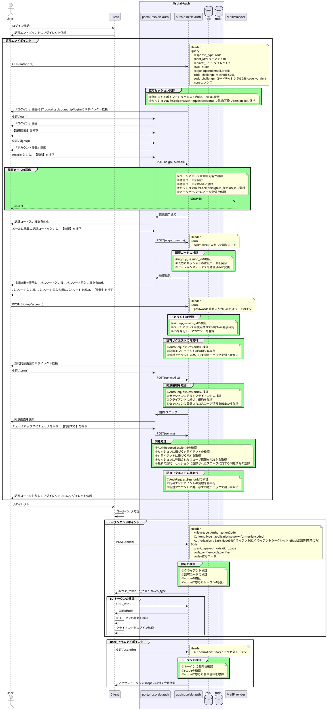

# アカウント登録フロー(省略版)

## ■ フロー概要
Authorization Code Flow中のアカウント登録フロー

## ■ シーケンス

```plantuml
@startuml
actor User
participant Client
box OsolabAuth #0000ff0f
    participant "portal.osolab-auth" as portal
    participant "auth.osolab-auth" as auth
    database rdb
    database mdb
end box
participant "MailProvider" as mail

User -> Client : ログイン開始
User <- Client : 認可エンドポイントにリダイレクト依頼
group 認可エンドポイント
    User -> auth : GET(/authorize)
    note right
        Header
        Query
            response_type: code
            client_id:クライアントID
            redirect_uri: リダイレクト先
            state: state
            scope: openid,email,profile
            code_challenge_method: S256
            code_challenge: コードチャレンジ(S256:code_verifier)
            nonce: ノンス
    end note
    group #PaleGreen 認可セッション発行
        note over auth,mdb
            ①認可エンドポイントのリクエスト内容をRedisに保持
            ②セッションIDをCookieのAuthRequestSessionIdに登録(互換でsession_idも保持)
        end note
    end
    User <- auth : 『ログイン』画面(GET portal.osolab-auth.jp/login)にリダイレクト依頼
    User -> portal : GET(/login)
    User <- portal : 『ログイン』画面
    User -> portal : 【新規登録】を押下
    User <-- portal
    User -> portal : GET(/Signup)
    User <- portal : 『アカウント登録』画面
    User -> portal : emailを入力し、【送信】を押下
    portal -> auth : POST(/signup/email)
        group #PaleGreen 認証メールの送信 
            note over auth,mail
                ①メールアドレスが利用可能か確認
                ②認証コードを発行
                ③認証コードをRedisに登録
                ④セッションIDをCookieのsignup_session_idに登録
                ⑤メールサーバーにメール送信を依頼
            end note
            auth --> mail : 送信依頼
            User <-- mail : 認証コード
        end
    portal <- auth : 送信完了通知
    User <- portal : 認証コード入力欄を有効化
    User -> portal : メールに記載の認証コードを入力し、【検証】を押下
    portal -> auth : POST(/signup/verify)
        note right
            Header
            Form
                code: 画面に入力した認証コード
        end note
        group #PaleGreen 認証コードの検証 
            note over auth,mdb
                ①signup_session_idの検証
                ②入力とセッションの認証コードを突合
                ③セッションステータスを認証済みに変更
            end note
        end
    portal <- auth : 検証結果
    User <- portal : 検証結果を表示し、パスワード入力欄、パスワード再入力欄を有効化
    User -> User : パスワード入力欄、パスワード再入力欄にパスワードを埋め、【登録】を押下
    User -> auth : POST(/signup/account)
        note right
            Header
            Form
                password: 画面に入力したパスワードの平文
        end note
        group #PaleGreen アカウントの登録 
            note over auth,mdb
                ①signup_session_idの検証
                ②メールアドレスが使用されていないか再度確認
                ③IDを発行し、アカウントを登録
            end note
        end
        group #PaleGreen 認可リクエストの再実行 
            note over auth,mdb
                ①AuthRequestSessionIdの検証
                ②認可エンドポイントの処理を再実行
                ③新規アカウントの為、必ず同意チェックで引っかかる
            end note
        end
    User <- auth : 規約同意画面にリダイレクト依頼
    User -> portal : GET(/terms)
    portal -> auth : POST(/terms/list)
        group #PaleGreen 同意情報を取得
            note over auth,mdb
                ①AuthRequestSessionIdの検証
                ②セッションに紐づくクライアントの検証
                ③クライアントに紐づく規約を取得
                ④セッションに登録されたスコープ情報をRDBから取得
            end note 
        end
    portal <- auth : 規約,スコープ
    User <- portal : 同意画面を表示
    User -> portal : チェックボックスにチェックを入れ、【同意する】を押下
    portal -> auth : POST(/terms)
        group #PaleGreen 同意処理
            note over auth,mdb
                ①AuthRequestSessionIdの検証
                ②セッションに紐づくクライアントの検証
                ③クライアントに紐づく規約を取得
                ④セッションに登録されたスコープ情報をRDBから取得
                ⑤最新の規約、セッションに登録されたスコープに対する同意情報の登録
            end note 
        end
        group #PaleGreen 認可リクエストの再実行 
            note over auth,mdb
                ①AuthRequestSessionIdの検証
                ②認可エンドポイントの処理を再実行
                ③新規アカウントの為、必ず同意チェックで引っかかる
            end note
        end
    User <- auth : 認可コードを付与してリダイレクトURLにリダイレクト依頼
end
User -> Client :リダイレクト
Client -> Client : コールバック処理

group トークンエンドポイント
    Client -> auth : POST(/token)
    note right
        Header
            x-flow-type: AuthorizationCode
            Content-Type : application/x-www-form-urlencoded
            Authorization : Basic Base64(クライアントID:クライアントシークレット) (Basic認証利用時のみ)
        Body
            grant_type=authorization_code
            code_verifier=code_verifier
            code=認可コード
    end note
    group #PaleGreen 認可の検証 
        note over auth,mdb
            ①クライアント検証
            ②認可コードの検証
            ③scopeの検証
            ④scopeに応じたトークンの発行
        end note
    end
    
    Client <- auth : access_token, id_token, token_type
    group ID トークンの検証
        Client -> auth : GET(/jwks)
        Client <- auth : 公開鍵情報
        Client -> Client : IDトークンの署名を検証
        Client -> Client : クライアント側ログイン処理
    end
end
group user_infoエンドポイント
    Client -> auth : GET(/userinfo)
    note right
        Header
            Authorization: Bearer アクセストークン
    end note
    group #PaleGreen トークンの検証 
        note over auth,mdb
            ①トークンの有効性確認
            ②scopeの検証
            ③scopeに応じた会員情報を取得
        end note
    end
    Client <- auth : アクセストークンのscopeに紐づく会員情報
end

@enduml
```
