# クライアント登録フロー

## ■ フロー概要

OAuth 2.1 準拠のクライアント登録フローを定義する。  
`client_master.client_type = 0` を Public、`client_master.client_type = 1` を Confidential、`client_master.client_type = 99` を InnerClient とする。  
本フローで登録可能なのは Public / Confidential のみとし、InnerClient は IdP 直轄の内部専用クライアントとしてSQL追加のみとする。

## ■ 登録対象

| 項目 | 内容 |
| :--- | :--- |
| client_master | クライアント本体。`client_type` を保持する |
| client_redirect_uri | 認可後の戻り先URIを完全一致で登録する |
| client_scope | クライアントが要求可能な scope を登録する |
| client_data_key | クライアントで利用可能な属性キーを登録する |

## ■ シーケンス

```plantuml
@startuml
actor "App Developer" as developer
participant "Client Register UI" as ui
participant "AuthFoundation" as auth
database "RDB" as rdb

developer -> ui : クライアント登録画面を開く
ui -> auth : 登録画面表示要求
auth --> ui : 入力フォーム返却

developer -> ui : クライアント情報入力
note right of developer
  - client_name
  - client_type
  - redirect_uri 一覧
  - 利用scope
  - 利用属性
end note

ui -> auth : クライアント登録要求

group 入力値検証
  auth -> auth : 必須項目チェック
  auth -> auth : client_type値チェック(Public/Confidentialのみ許可)
  auth -> auth : redirect_uri形式チェック
  auth -> rdb : SELECT scope_master
  note right
    選択scopeの存在確認
    confidential_only取得
  end note
  auth <-- rdb : scope情報
  auth -> auth : scope/data_keyの存在チェック
  auth -> auth : Public + confidential_only scope の禁止検証
  auth -> auth : redirect_uri重複チェック
end

alt 入力不正
  auth --> ui : エラー返却
  ui --> developer : 入力エラー表示
else 入力正常
  group クライアントID採番
    auth -> auth : client_id生成
  end

  alt client_type = Confidential
    auth -> auth : client_secret生成
  else client_type = Public
    auth -> auth : client_secret = 空
  end

  group クライアント登録
    auth -> rdb : INSERT client_master
    note right
      client_id
      client_name
      client_secret
      client_type
      status = 1
    end note
    auth <-- rdb
  end

  group redirect_uri登録
    loop 登録対象URIごと
      auth -> rdb : INSERT client_redirect_uri
      note right
        client_id
        redirect_uri
        is_default
        status = 1
      end note
      auth <-- rdb
    end
  end

  group scope登録
    loop 許可scopeごと
      auth -> rdb : INSERT client_scope
      note right
        client_id
        scope
        required
        status = 1
      end note
      auth <-- rdb
    end
  end

  group 属性キー登録
    loop 利用属性ごと
      auth -> rdb : INSERT client_data_key
      note right
        client_id
        data_key
        status = 1
      end note
      auth <-- rdb
    end
  end

  alt client_type = Confidential
    auth --> ui : 登録完了(client_id, client_secret)
    ui --> developer : client_id / client_secret表示
  else client_type = Public
    auth --> ui : 登録完了(client_id)
    ui --> developer : client_id表示
  end
end

== 認可時 ==

developer -> ui : 登録済み設定で動作確認
ui -> auth : GET /authorize
note right of ui
  client_id = 登録済みclient_id
  redirect_uri = 登録済みURI
  response_type = code
  code_challenge_method = S256
  code_challenge = ...
end note

group 認可要求検証
  auth -> rdb : SELECT client_master
  note right
    WHERE client_id = ?
      AND status = 1
  end note
  auth <-- rdb : client情報

  auth -> rdb : SELECT client_redirect_uri
  note right
    WHERE client_id = ?
      AND redirect_uri = ?
      AND status = 1
  end note
  auth <-- rdb : redirect_uri一致結果

  alt client_type = InnerClient
    auth -> auth : scope制限をスキップ
  else
    auth -> rdb : SELECT client_scope
    note right
      WHERE client_id = ?
        AND scope IN 要求scope
        AND status = 1
    end note
    auth <-- rdb : scope一致結果
  end

  auth -> auth : PKCE必須チェック
end

alt 設定不整合
  auth --> ui : invalid_client / invalid_request
else 設定正常
  auth --> ui : 認可フロー継続
end

== トークン交換時 ==

ui -> auth : POST /token
note right of ui
  grant_type = authorization_code
  client_id = 登録済みclient_id
  code_verifier = ...
  redirect_uri = 認可時と同一
  Public: Authorization header なし
  Confidential: Basic認証あり
end note

group クライアント検証
  auth -> rdb : SELECT client_master
  note right
    WHERE client_id = ?
      AND status = 1
  end note
  auth <-- rdb : client情報

  alt client_type = Confidential
    auth -> auth : Authorization header検証
    auth -> auth : client_secret照合
  else client_type = Public
    auth -> auth : client_secret認証不要判定
  end

  auth -> auth : redirect_uri完全一致照合
  auth -> auth : PKCE(code_verifier)検証
end

alt 検証失敗
  auth --> ui : invalid_client / invalid_grant
else 検証成功
  auth --> ui : access_token / id_token発行
end

@enduml
```

## ■ 補足

- OAuth 2.1 前提として、Public / Confidential を問わず認可要求時の PKCE を必須とする。
- `redirect_uri` は [client_redirect_uri](../Data/RDB_Table/client_redirect_uri.md) の完全一致で検証する。
- `scope_master.confidential_only=1` の scope は Confidential Client と InnerClient のみ利用可能とし、通常の登録画面と登録APIでは Public への設定を禁止する。
- Public Client は `client_secret` を利用しないため、登録時は空文字または未使用値を保存する。
- Confidential Client は登録完了時に `client_secret` を払い出し、`POST /token` でクライアント認証を行う。
- InnerClient は IdP 直轄の特権クライアントであり、通常の外部登録フローでは作成しない。
