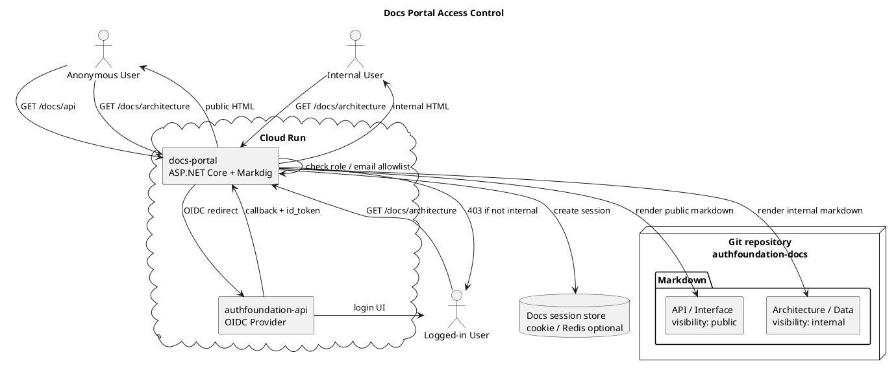

# Docs Portal アクセス制御構成

HonKit は静的サイト生成ツールなので、認証・認可は別アプリで担当する。
将来的には Markdown を直接読む Docs Portal を Cloud Run に置き、AuthFoundation OIDC でログインさせる。



## Access model

```text
visibility: public
  未ログインでも閲覧可

visibility: authenticated
  ログイン済みなら閲覧可

visibility: internal
  internal role / email allowlist のみ閲覧可
```

## Notes

- 内部資料を 1 つの静的 HonKit build に含め、JavaScript で隠すだけの方式は使わない。
- 公開用 build と内部用 build を分けるか、Docs Portal で Markdown front matter を見て出し分ける。
- 初期実装は email allowlist でよい。後から `role=internal` claim へ移行する。
