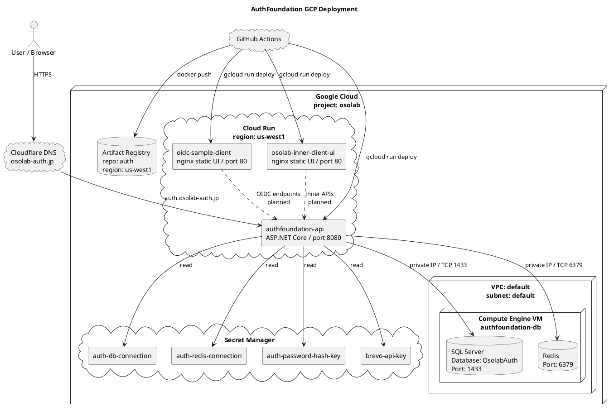

# GCP デプロイ構成

AuthFoundation を GCP に移行した後の初期構成です。
Cloud Run はアプリコンテナ、Compute Engine VM は SQL Server / Redis のデータ層として扱います。

## Notes

- Cloud Run と Artifact Registry は `us-west1` に揃える。
- SQL Server / Redis は VM 上で手動運用する。
- Cloud Run から VM へは Direct VPC egress で private IP 接続する。
- GitHub Actions の GCP 認証は Workload Identity Federation を使い、JSON key は使わない。
- Cloudflare は DNS / optional proxy として使う。証明書発行までは `DNS only` を基本にする。
