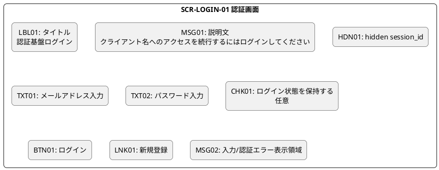

# 認証画面設計

## ■ 目的

OAuth/OIDC の認可処理中に未ログインユーザーへ表示する認証画面の設計を定義する。  
本画面は `GET /login` で表示し、`POST /login` で認証を実行する。

## ■ 画面概要

| 項目 | 内容 |
|:---|:---|
| 画面名 | 認証画面 |
| 画面ID | SCR-LOGIN-01 |
| 表示契機 | 認可エンドポイントで未ログインと判定された場合 |
| 初期表示API | `GET /login?session_id=...` |
| 送信API | `POST /login` |
| 主目的 | メールアドレスとパスワードで本人認証を行い、認可処理を継続する |

## ■ ワイヤーフレーム

## ■ 要素一覧

| 要素ID | 要素名 | 種別 | 必須 | 説明 |
|:---|:---|:---|:---:|:---|
| LBL01 | タイトル | Label | - | 画面の目的を示す固定文言 |
| MSG01 | 説明文 | Label | - | 認可処理継続のためのログインであることを説明 |
| HDN01 | session_id | Hidden | ○ | `GET /login` の query で受け取った認可セッションID |
| TXT01 | メールアドレス | TextBox | ○ | ログイン対象メールアドレス |
| TXT02 | パスワード | Password | ○ | クライアント側でハッシュ化して送信する元入力欄 |
| CHK01 | ログイン状態保持 | CheckBox | - | セッション維持ポリシー拡張用の任意項目 |
| BTN01 | ログイン | Button | ○ | 入力値検証後に `POST /login` を呼び出す |
| LNK01 | 新規登録 | Link | - | アカウント未所持ユーザー向け導線 |
| MSG02 | エラー表示領域 | Message Area | - | 入力不備、認証失敗、システムエラーを表示 |

## ■ 入力仕様

| 項目 | 要素ID | 形式 | バリデーション | 備考 |
|:---|:---|:---|:---|:---|
| session_id | HDN01 | String | `^[A-Za-z0-9_-]{20,}$` | `GET /login` の query と同値 |
| email | TXT01 | String | `^.+@.+$` | 前後空白は除去して検証 |
| password | TXT02 | String | 8文字以上128文字以下 | 送信時はハッシュ化済み値を `password` として送る |

## ■ イベント一覧

| イベントID | 要素ID | イベント | 条件 | 処理内容 | 結果 |
|:---|:---|:---|:---|:---|:---|
| EV01 | TXT01 | フォーカスアウト | 入力あり | メールアドレス形式を簡易チェック | 不正時は MSG02 にエラー表示 |
| EV02 | TXT02 | フォーカスアウト | 入力あり | 桁数チェック | 不正時は MSG02 にエラー表示 |
| EV03 | BTN01 | クリック | 必須項目未入力 | 未入力チェック | 該当項目エラーを表示し送信しない |
| EV04 | BTN01 | クリック | 入力形式不正 | 形式チェック | エラーを表示し送信しない |
| EV05 | BTN01 | クリック | 入力正常 | `password` をハッシュ化し `POST /login` を実行 | 応答待ち中はボタンを二重押下不可にする |
| EV06 | BTN01 | API成功 | `result=redirect` | Cookie 反映後、`Location` へ遷移 | 認可処理または規約同意へ進む |
| EV07 | BTN01 | API失敗 | `result=error` | `message` を MSG02 に表示 | 画面に留まり再入力可能 |
| EV08 | LNK01 | クリック | なし | 新規登録画面へ遷移 | `session_id` を維持して遷移 |

## ■ API送信仕様

### Request

| 項目 | 設定値 |
|:---|:---|
| Method | `POST` |
| Path | `/login` |
| Header | `x-session-id: {HDN01}` |
| Header | `Content-Type: application/x-www-form-urlencoded` |
| Body | `email={TXT01}&password={hash(TXT02)}` |

### Response

| 条件 | 処理 |
|:---|:---|
| 認証成功かつ同意済み | `Location` に従いクライアントへリダイレクト |
| 認証成功かつ未同意 | `Location` に従い規約同意画面へ遷移 |
| 認証失敗 | `message` を画面表示し再入力を促す |

## ■ 画面遷移

| 遷移元 | 条件 | 遷移先 |
|:---|:---|:---|
| 認可エンドポイント | 未ログイン | 本画面 |
| 本画面 | ログイン成功かつ同意済み | `redirect_uri` への認可リダイレクト |
| 本画面 | ログイン成功かつ未同意 | 規約同意画面 |
| 本画面 | 新規登録リンク押下 | 新規登録画面 |

## ■ エラーメッセージ例

| ケース | 表示文言例 |
|:---|:---|
| メールアドレス未入力 | メールアドレスを入力してください。 |
| メールアドレス形式不正 | メールアドレスの形式が不正です。 |
| パスワード未入力 | パスワードを入力してください。 |
| パスワード桁数不正 | パスワードの形式が不正です。 |
| 認証失敗 | メールアドレスまたはパスワードが正しくありません。 |
| セッション不正 | 画面の有効期限が切れました。再度ログインをやり直してください。 |

## ■ 補足

- `session_id` は URL query で受け取るが、送信時は `x-session-id` header に設定する。
- クライアント側ハッシュ化の詳細仕様は別途フロントエンド実装規約で定義する。
- `CHK01` は現時点では任意項目だが、将来のセッション保持ポリシー拡張を見越して識別子を確保する。
