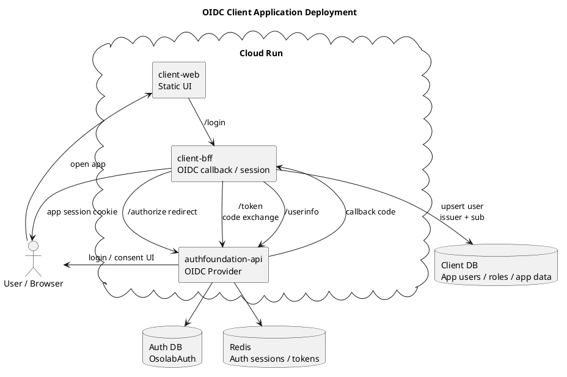

# OIDC クライアント構成

`oidc-sample-client` を実サービス化する場合の構成案です。
静的 HTML だけではアプリ用 DB と安全な `client_secret` 管理ができないため、Backend for Frontend または API backend を追加します。

## Notes

- クライアント DB には AuthFoundation のパスワードを持たない。
- クライアント側の主キーは `issuer + sub` を基準にする。
- Confidential client の `client_secret` は browser に置かず、BFF / backend 側で保持する。
- SPA 単体構成にする場合は public client + PKCE とし、DB は API backend 側に持たせる。
