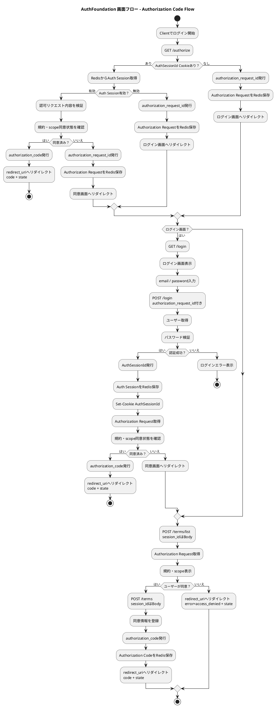

```plantuml
@startuml
title AuthFoundation 画面フロー - Authorization Code Flow

start

:Clientでログイン開始;
:GET /authorize;

if (AuthSessionId Cookieあり？) then (あり)
  :RedisからAuth Session取得;

  if (Auth Session有効？) then (有効)
    :認可リクエスト内容を検証;
    :規約・scope同意状態を確認;

    if (同意済み？) then (はい)
      :authorization_code発行;
      :redirect_uriへリダイレクト\ncode + state;
      stop
    else (いいえ)
      :authorization_request_id発行;
      :Authorization RequestをRedis保存;
      :同意画面へリダイレクト;
    endif

  else (無効)
    :authorization_request_id発行;
    :Authorization RequestをRedis保存;
    :ログイン画面へリダイレクト;
  endif

else (なし)
  :authorization_request_id発行;
  :Authorization RequestをRedis保存;
  :ログイン画面へリダイレクト;
endif

if (ログイン画面？) then (はい)
  :GET /login;
  :ログイン画面表示;

  :email / password入力;
  :POST /login\nauthorization_request_id付き;

  :ユーザー取得;
  :パスワード検証;

  if (認証成功？) then (はい)
    :AuthSessionId発行;
    :Auth SessionをRedis保存;
    :Set-Cookie AuthSessionId;

    :Authorization Request取得;
    :規約・scope同意状態を確認;

    if (同意済み？) then (はい)
      :authorization_code発行;
      :redirect_uriへリダイレクト\ncode + state;
      stop
    else (いいえ)
      :同意画面へリダイレクト;
    endif

  else (いいえ)
    :ログインエラー表示;
    stop
  endif
endif

:POST /terms/list\nsession_idはBody;
:Authorization Request取得;
:規約・scope表示;

if (ユーザーが同意？) then (はい)
  :POST /terms\nsession_idはBody;
  :同意情報を登録;

  :authorization_code発行;
  :Authorization CodeをRedis保存;

  :redirect_uriへリダイレクト\ncode + state;
else (いいえ)
  :redirect_uriへリダイレクト\nerror=access_denied + state;
endif

stop
@enduml
```
