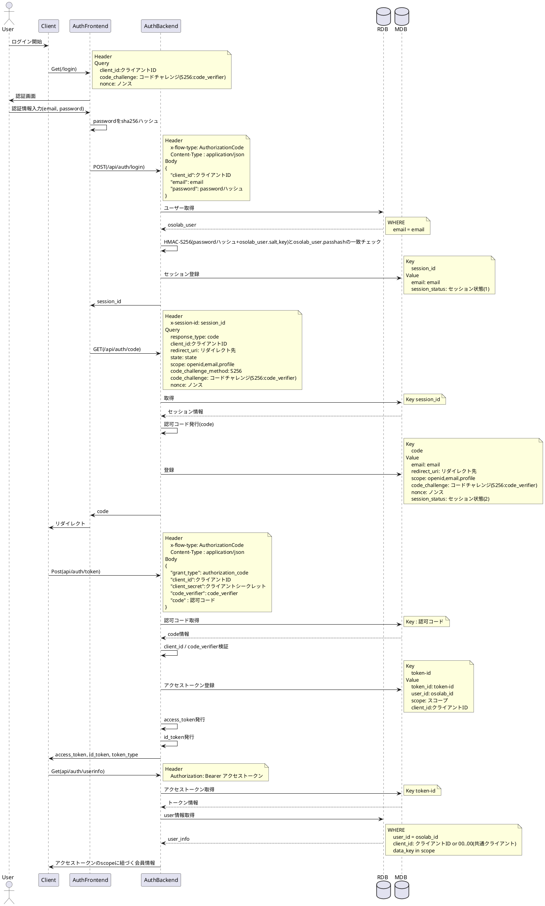

# 認証フロー

## ■ フロー概要
Authorization Code Flowをベース

## ■ シーケンス

```plantuml
@startuml
actor User
participant Client
participant "AuthFrontend" as AuthFR
participant "AuthBackend" as AuthBK
database RDB
database MDB

User -> Client : ログイン開始
Client -> AuthFR : Get(/login)
note right
    Header
    Query
        client_id:クライアントID
        code_challenge: コードチャレンジ(S256:code_verifier)
        nonce: ノンス
end note
User <- AuthFR : 認証画面
User -> AuthFR : 認証情報入力(email, password)
AuthFR -> AuthFR : passwordをsha256ハッシュ
AuthFR -> AuthBK : POST(/api/auth/login)
note right
    Header
        x-flow-type: AuthorizationCode
        Content-Type : application/json
    Body
    {
        "client_id":クライアントID
        "email": email
        "password": passwordハッシュ
    }
end note
AuthBK -> RDB : ユーザー取得
AuthBK <-- RDB : osolab_user
note right 
    WHERE
        email = email
end note
AuthBK -> AuthBK : HMAC-S256(passwordハッシュ+osolab_user.salt,key)とosolab_user.passhashの一致チェック
AuthBK -> MDB : セッション登録
note right 
    Key
        session_id
    Value
        email: email
        session_status: セッション状態(1)
end note
AuthFR <- AuthBK : session_id
AuthFR -> AuthBK : GET(/api/auth/code)
note right
    Header
        x-session-id: session_id
    Query
        response_type: code
        client_id:クライアントID
        redirect_uri: リダイレクト先
        state: state
        scope: openid,email,profile
        code_challenge_method: S256
        code_challenge: コードチャレンジ(S256:code_verifier)
        nonce: ノンス
end note
AuthBK -> MDB : 取得
note right 
    Key session_id
end note
AuthBK <-- MDB : セッション情報
AuthBK -> AuthBK : 認可コード発行(code)
AuthBK -> MDB : 登録
note right 
    Key
        code
    Value
        email: email
        redirect_uri: リダイレクト先
        scope: openid,email,profile
        code_challenge: コードチャレンジ(S256:code_verifier)
        nonce: ノンス
        session_status: セッション状態(2)
end note
AuthFR <- AuthBK : code
Client <- AuthFR : リダイレクト
Client -> AuthBK : Post(api/auth/token)
note right
    Header
        x-flow-type: AuthorizationCode
        Content-Type : application/json
    Body
    {
        "grant_type": authorization_code
        "client_id":クライアントID
        "client_secret":クライアントシークレット
        "code_verifier": code_verifier
        "code" : 認可コード
    }
end note
AuthBK -> MDB : 認可コード取得
note right 
    Key : 認可コード
end note
AuthBK <-- MDB : code情報
AuthBK -> AuthBK : client_id / code_verifier検証
AuthBK -> MDB : アクセストークン登録
note right 
    Key
        token-id
    Value
        token_id: token-id
        user_id: osolab_id
        scope: スコープ
        client_id:クライアントID
end note
AuthBK -> AuthBK : access_token発行
AuthBK -> AuthBK : id_token発行
Client <- AuthBK : access_token, id_token, token_type

Client -> AuthBK : Get(api/auth/userinfo)
note right
    Header
        Authorization: Bearer アクセストークン
end note
AuthBK -> MDB : アクセストークン取得
note right 
    Key token-id
end note
AuthBK <-- MDB : トークン情報
AuthBK -> RDB : user情報取得
AuthBK <-- RDB : user_info
note right 
    WHERE
        user_id = osolab_id
        client_id: クライアントID or 00..00(共通クライアント)
        data_key in scope
end note
Client <- AuthBK : アクセストークンのscopeに紐づく会員情報

@enduml
```

## ■ ステップ
1. 認可リクエスト
2. 認証
3. 認可コード発行
4. トークン交換

## ■ 補足
- stateでCSRF対策
- PKCE対応予定