# RDB総合

## テーブル一覧

### 実装済みテーブル

| TableName | PhysicalName | Purpose |
| :--- | :--- | :--- |
| クライアントマスタ | [client_master](./RDB_Table/client_master.md) | 認証基盤を利用するクライアントアプリケーションを管理する |
| ユーザーテーブル | [osolab_user](./RDB_Table/osolab_user.md) | 認証基盤のユーザーアカウントを管理する |
| ユーザー属性テーブル | [user_info](./RDB_Table/user_info.md) | クライアントごとにユーザーへ紐づく属性値を管理する |
| 属性キー管理マスタ | [data_key_master](./RDB_Table/data_key_master.md) | UserInfoで利用する属性キー定義を管理する |
| クライアント属性許可テーブル | [client_data_key](./RDB_Table/client_data_key.md) | クライアントが利用可能な属性キーを管理する |

### 実装済みテーブル（拡張分）

| TableName | PhysicalName | Purpose |
| :--- | :--- | :--- |
| クライアントリダイレクトURI | [client_redirect_uri](./RDB_Table/client_redirect_uri.md) | クライアントごとに許可する `redirect_uri` を複数管理する |
| Scope管理マスタ | [scope_master](./RDB_Table/scope_master.md) | OpenID Connect / OAuth2 の要求可能 scope を管理する |
| クライアント許可Scope | [client_scope](./RDB_Table/client_scope.md) | クライアントごとに要求可能な scope を管理する |
| Scope-Claimマッピング | [scope_data_key](./RDB_Table/scope_data_key.md) | scope と返却可能 claim を対応付ける |
| クライアント適用規約 | [client_term](./RDB_Table/client_term.md) | クライアントごとに同意対象とする規約を管理する |
| ユーザー規約同意履歴 | [user_term_consent](./RDB_Table/user_term_consent.md) | ユーザーの規約同意結果と対象バージョンを記録する |
| ユーザーScope同意履歴 | [user_client_scope_consent](./RDB_Table/user_client_scope_consent.md) | ユーザーがクライアントごとに同意した scope を記録する |
| JWK管理マスタ | [jwk_master](./RDB_Table/jwk_master.md) | IDトークン署名鍵の公開情報と暗号化済み秘密鍵を管理する |

## 実装反映ポイント

| 対象 | 実装内容 |
| :--- | :--- |
| リダイレクトURI管理 | `client_redirect_uri` で `client_id` ごとに複数URIを管理 |
| scope検証 | `scope_master` + `client_scope` で要求可能scopeを管理 |
| UserInfo返却 | `scope_data_key` で scope と claim を対応付け |
| 規約表示・同意 | `client_term` で `term_id` / `term_version` / `term_url` / `required` を管理し、同意履歴は `user_term_consent` に保存 |
| scope同意状態 | `user_client_scope_consent` にクライアント単位で保存 |
| IDトークン署名鍵 | `jwk_master` で公開鍵と暗号化済み秘密鍵を管理し `GET /jwks` に公開 |

## 既存テーブルの拡張ポイント

| Table | 現状 | 追加推奨項目 |
| :--- | :--- | :--- |
| `client_master` | クライアント識別子・名称・シークレットのみ | `client_type`、`token_endpoint_auth_method`、`require_pkce` など |
| `osolab_user` | ログイン用最小情報のみ | 表示名やプロフィール画像は `user_info` 運用でも可。必要ならメール検証日時の保持も検討 |
| `user_info` | 属性値格納のみ | `data_key_master` へのFK追加、共通クライアント属性の扱い明文化 |

## 補足

- 実装済みDDLは `Auth/SQL/000_init_db.sql` を基準としている。
- 追加分として整理していたテーブルは現行DDLに実装済み。
- ログインセッション、認可コード、アクセストークン、IDトークン失効管理は [Redis.md](./Redis.md) の責務であり、本書ではRDB要素に限定して記載する。

## ER図

```plantuml
@startuml

entity "client_master" as client_master {
  *client_id : varchar(32)
  --
  client_name : nvarchar(64)
  client_secret : varchar(64)
  create_datetime : datetime2(0)
  update_datetime : datetime2(0)
  status : tinyint
}

entity "client_redirect_uri" as client_redirect_uri {
  *sequence_id : bigint
  --
  client_id : varchar(32)
  redirect_uri : nvarchar(2048)
  is_default : tinyint
  create_datetime : datetime2(0)
  update_datetime : datetime2(0)
  status : tinyint
}

entity "scope_master" as scope_master {
  *scope : varchar(64)
  --
  description : nvarchar(255)
  confidential_only : tinyint
  create_datetime : datetime2(0)
  update_datetime : datetime2(0)
  status : tinyint
}

entity "client_scope" as client_scope {
  *sequence_id : bigint
  --
  client_id : varchar(32)
  scope : varchar(64)
  required : tinyint
  create_datetime : datetime2(0)
  update_datetime : datetime2(0)
  status : tinyint
}

entity "data_key_master" as data_key_master {
  *data_key : varchar(64)
  --
  create_datetime : datetime2(0)
  update_datetime : datetime2(0)
}

entity "scope_data_key" as scope_data_key {
  *sequence_id : bigint
  --
  scope : varchar(64)
  data_key : varchar(64)
  create_datetime : datetime2(0)
  update_datetime : datetime2(0)
  status : tinyint
}

entity "jwk_master" as jwk_master {
  *sequence_id : bigint
  --
  kid : varchar(64)
  kty : varchar(16)
  alg : varchar(16)
  key_use : varchar(16)
  public_n : varchar(512)
  public_e : varchar(16)
  private_key_ciphertext : varbinary(max)
  private_key_iv : varbinary(12)
  private_key_tag : varbinary(16)
  create_datetime : datetime2(0)
  update_datetime : datetime2(0)
  status : tinyint
}

entity "osolab_user" as osolab_user {
  *osolab_id : nvarchar(16)
  --
  email : varchar(255)
  password : varchar(128)
  nonce : varchar(8)
  create_datetime : datetime2(0)
  update_datetime : datetime2(0)
  status : tinyint
}

entity "user_info" as user_info {
  *osolab_id : nvarchar(16)
  *client_id : varchar(32)
  *data_key : varchar(64)
  --
  data_value : nvarchar(4000)
  create_datetime : datetime2(0)
  update_datetime : datetime2(0)
  status : tinyint
}

entity "client_term" as client_term {
  *sequence_id : bigint
  --
  client_id : varchar(32)
  term_id : varchar(64)
  term_version : varchar(32)
  term_url : nvarchar(2048)
  required : tinyint
  create_datetime : datetime2(0)
  update_datetime : datetime2(0)
  status : tinyint
}

entity "user_term_consent" as user_term_consent {
  *sequence_id : bigint
  --
  osolab_id : nvarchar(16)
  client_id : varchar(32)
  term_id : varchar(64)
  term_version : varchar(32)
  consent_result : tinyint
  consented_datetime : datetime2(0)
  create_datetime : datetime2(0)
}

entity "user_client_scope_consent" as user_client_scope_consent {
  *sequence_id : bigint
  --
  osolab_id : nvarchar(16)
  client_id : varchar(32)
  scope : varchar(64)
  consented_datetime : datetime2(0)
  create_datetime : datetime2(0)
  update_datetime : datetime2(0)
  status : tinyint
}

client_master ||--o{ client_redirect_uri
client_master ||--o{ user_info
client_master ||--o{ client_scope
client_master ||--o{ client_term
client_master ||--o{ user_term_consent
client_master ||--o{ user_client_scope_consent
osolab_user ||--o{ user_info
osolab_user ||--o{ user_term_consent
osolab_user ||--o{ user_client_scope_consent
scope_master ||--o{ client_scope
scope_master ||--o{ scope_data_key
data_key_master ||--o{ scope_data_key

@enduml
```

