# RDB総合

## テーブル一覧

### 実装済みテーブル

| TableName | PhysicalName | Purpose |
| :--- | :--- | :--- |
| クライアントマスタ | [client_master](./RDB_Table/client_master.md) | 認証基盤を利用するクライアントアプリケーションを管理する |
| ユーザーテーブル | [osolab_user](./RDB_Table/osolab_user.md) | 認証基盤のユーザーアカウントを管理する |
| ユーザー属性テーブル | [user_info](./RDB_Table/user_info.md) | クライアントごとにユーザーへ紐づく属性値を管理する |
| 属性キー管理マスタ | [data_key_master](./RDB_Table/data_key_master.md) | UserInfoで利用する属性キー定義を管理する |
| クライアント属性許可テーブル | [client_data_key](./RDB_Table/client_data_key.md) | クライアントが利用可能な属性キーを管理する |

### 仕様実装に必要な追加テーブル

| TableName | PhysicalName | Purpose |
| :--- | :--- | :--- |
| クライアントリダイレクトURI | [client_redirect_uri](./RDB_Table/client_redirect_uri.md) | クライアントごとに許可する `redirect_uri` を複数管理する |
| Scope管理マスタ | [scope_master](./RDB_Table/scope_master.md) | OpenID Connect / OAuth2 の要求可能 scope を管理する |
| クライアント許可Scope | [client_scope](./RDB_Table/client_scope.md) | クライアントごとに要求可能な scope を管理する |
| Scope-Claimマッピング | [scope_data_key](./RDB_Table/scope_data_key.md) | scope と返却可能 claim を対応付ける |
| 規約マスタ | [term_master](./RDB_Table/term_master.md) | 規約本文・版数・有効期間を管理する |
| クライアント適用規約 | [client_term](./RDB_Table/client_term.md) | クライアントごとに同意対象とする規約を管理する |
| ユーザー規約同意履歴 | [user_term_consent](./RDB_Table/user_term_consent.md) | ユーザーの規約同意結果と対象バージョンを記録する |
| ユーザーScope同意履歴 | [user_client_scope_consent](./RDB_Table/user_client_scope_consent.md) | ユーザーがクライアントごとに同意した scope を記録する |

## 仕様実装に対する不足整理

| 対象 | 不足している内容 | 必要な対応 |
| :--- | :--- | :--- |
| 認可エンドポイント | `redirect_uri` の事前登録先がない | `client_redirect_uri` を追加し、`client_id` ごとに複数管理する |
| トークンエンドポイント | 認可時と同一 `redirect_uri` の照合元がない | `client_redirect_uri` と認可コード保存値の両方で完全一致検証する |
| 規約表示・同意 | 規約マスタ、クライアント別適用設定、同意履歴がない | `term_master`、`client_term`、`user_term_consent` を追加する |
| scope検証 | 要求可能scopeのマスタとクライアント別許可設定がない | `scope_master`、`client_scope` を追加する |
| UserInfo返却 | scope と claim の対応表がない | `scope_data_key` を追加する |
| scope同意状態 | ユーザーがクライアントごとに何に同意したか保持できない | `user_client_scope_consent` を追加する |
| クライアント認証方式 | `client_master` だけでは public/confidential や認証方式を表現できない | `client_master` に種別列を追加するか別設定テーブルで管理する |
| 同意監査 | 最新状態しか持てない設計だと同意履歴が追えない | 規約・scopeともに履歴テーブルとして保存する |

## 既存テーブルの拡張ポイント

| Table | 現状 | 追加推奨項目 |
| :--- | :--- | :--- |
| `client_master` | クライアント識別子・名称・シークレットのみ | `client_type`、`token_endpoint_auth_method`、`require_pkce` など |
| `osolab_user` | ログイン用最小情報のみ | 表示名やプロフィール画像は `user_info` 運用でも可。必要ならメール検証日時の保持も検討 |
| `user_info` | 属性値格納のみ | `data_key_master` へのFK追加、共通クライアント属性の扱い明文化 |

## 補足

- 実装済みDDLは `Auth/SQL/000_init_db.sql` を基準としている。
- 追加テーブルは現行ソースコード未実装だが、`authfoundation-docs/API` および `authfoundation-docs/Architecture` の仕様を成立させるために必要な設計として整理した。
- ログインセッション、認可コード、アクセストークン、IDトークン失効管理は [Redis.md](./Redis.md) の責務であり、本書ではRDB要素に限定して記載する。

## ER図

```plantuml
@startuml

entity "client_master" as client_master {
  *client_id : varchar(32)
  --
  client_name : nvarchar(64)
  client_secret : varchar(64)
  create_datetime : datetime2(0)
  update_datetime : datetime2(0)
  status : tinyint
}

entity "client_redirect_uri" as client_redirect_uri {
  *sequence_id : bigint
  --
  client_id : varchar(32)
  redirect_uri : nvarchar(2048)
  is_default : tinyint
  create_datetime : datetime2(0)
  update_datetime : datetime2(0)
  status : tinyint
}

entity "scope_master" as scope_master {
  *scope : varchar(64)
  --
  description : nvarchar(255)
  create_datetime : datetime2(0)
  update_datetime : datetime2(0)
  status : tinyint
}

entity "client_scope" as client_scope {
  *sequence_id : bigint
  --
  client_id : varchar(32)
  scope : varchar(64)
  required : tinyint
  create_datetime : datetime2(0)
  update_datetime : datetime2(0)
  status : tinyint
}

entity "data_key_master" as data_key_master {
  *data_key : varchar(64)
  --
  create_datetime : datetime2(0)
  update_datetime : datetime2(0)
}

entity "scope_data_key" as scope_data_key {
  *sequence_id : bigint
  --
  scope : varchar(64)
  data_key : varchar(64)
  create_datetime : datetime2(0)
  update_datetime : datetime2(0)
  status : tinyint
}

entity "osolab_user" as osolab_user {
  *osolab_id : nvarchar(16)
  --
  email : varchar(255)
  password : varchar(128)
  nonce : varchar(8)
  create_datetime : datetime2(0)
  update_datetime : datetime2(0)
  status : tinyint
}

entity "user_info" as user_info {
  *osolab_id : nvarchar(16)
  *client_id : varchar(32)
  *data_key : varchar(64)
  --
  data_value : nvarchar(4000)
  create_datetime : datetime2(0)
  update_datetime : datetime2(0)
  status : tinyint
}

entity "term_master" as term_master {
  *term_id : varchar(64)
  --
  term_type : varchar(32)
  title : nvarchar(255)
  version : varchar(32)
  content : nvarchar(max)
  effective_start_datetime : datetime2(0)
  effective_end_datetime : datetime2(0)
  create_datetime : datetime2(0)
  update_datetime : datetime2(0)
  status : tinyint
}

entity "client_term" as client_term {
  *sequence_id : bigint
  --
  client_id : varchar(32)
  term_id : varchar(64)
  required : tinyint
  display_order : int
  create_datetime : datetime2(0)
  update_datetime : datetime2(0)
  status : tinyint
}

entity "user_term_consent" as user_term_consent {
  *sequence_id : bigint
  --
  osolab_id : nvarchar(16)
  client_id : varchar(32)
  term_id : varchar(64)
  term_version : varchar(32)
  consent_result : tinyint
  consented_datetime : datetime2(0)
  create_datetime : datetime2(0)
}

entity "user_client_scope_consent" as user_client_scope_consent {
  *sequence_id : bigint
  --
  osolab_id : nvarchar(16)
  client_id : varchar(32)
  scope : varchar(64)
  consented_datetime : datetime2(0)
  create_datetime : datetime2(0)
  update_datetime : datetime2(0)
  status : tinyint
}

client_master ||--o{ client_redirect_uri
client_master ||--o{ user_info
client_master ||--o{ client_scope
client_master ||--o{ client_term
client_master ||--o{ user_term_consent
client_master ||--o{ user_client_scope_consent
osolab_user ||--o{ user_info
osolab_user ||--o{ user_term_consent
osolab_user ||--o{ user_client_scope_consent
scope_master ||--o{ client_scope
scope_master ||--o{ scope_data_key
data_key_master ||--o{ scope_data_key
term_master ||--o{ client_term
term_master ||--o{ user_term_consent

@enduml
```

