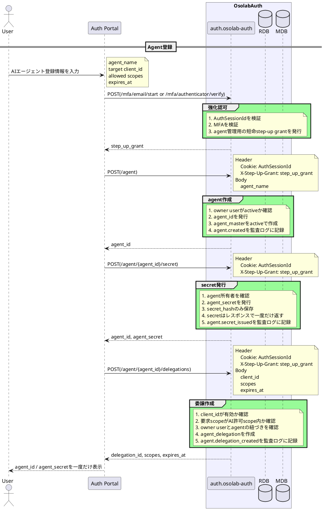
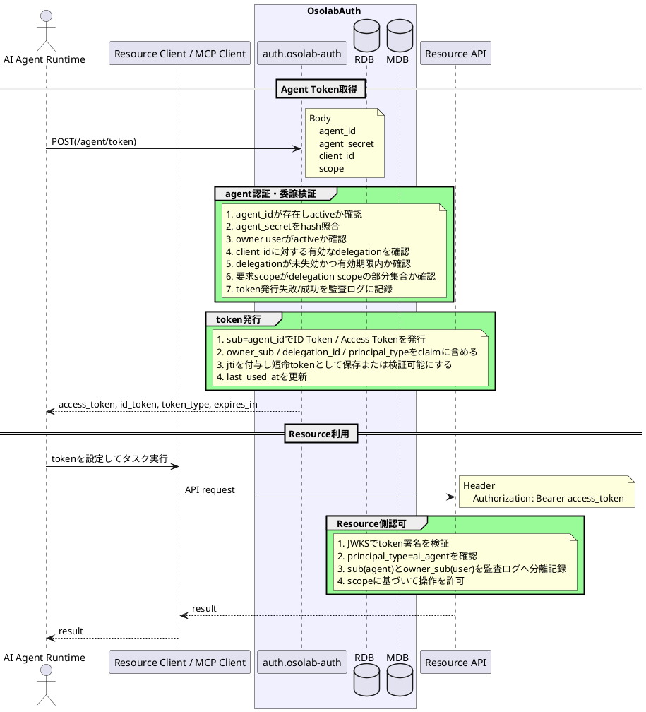
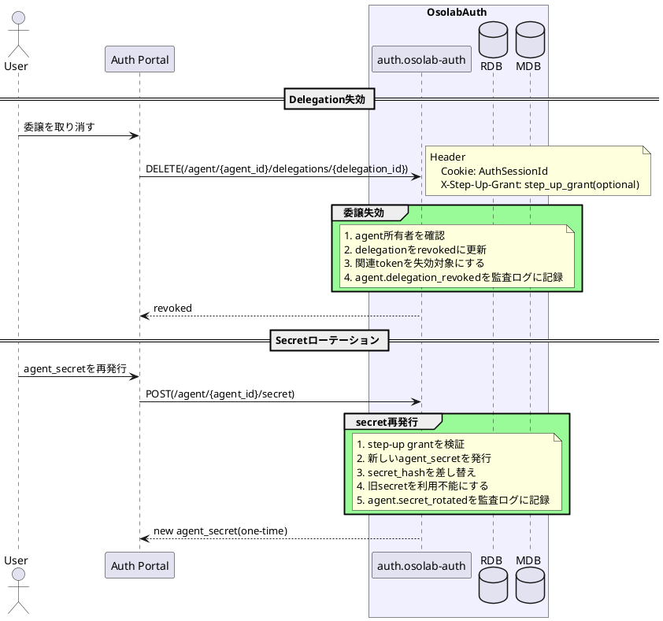

# AI Agent Delegated Auth Flow

## 概要

AIエージェントが、人間ユーザーから委譲された範囲で短命tokenを取得する認証認可フロー。

通常の人間ユーザー向けAuthorization Code Flowとは分離する。AIエージェントは `/authorize` にリダイレクトされる主体ではなく、専用の `agent_id` / `agent_secret` で `/agent/token` を呼び出す。

画面表示はPortal側の責務とし、Auth backendには画面表示用endpointを追加しない。

## 登録・委譲フロー

## Token発行フロー

## 失効・ローテーションフロー

## 認可判断

Resource側は次のclaimを見て、人間ユーザー操作とAIエージェント操作を分離する。

| claim | 用途 |
| :--- | :--- |
| `sub` | 操作主体。AIエージェントの場合は `agent_id` |
| `principal_type` | `user` または `ai_agent` |
| `owner_sub` | AIエージェントの代理元ユーザー |
| `delegation_id` | どの委譲に基づく操作か |
| `scope` | 許可操作 |

監査ログでは、最低限以下を記録する。

- actor: `sub`
- actor_type: `principal_type`
- owner: `owner_sub`
- delegation_id
- client_id
- scope
- resource
- result

## Phase 2以降

- 高リスク操作の都度承認
- Manual Agent Pairing Flow
- Device Agent Pairing Flow
- Token Exchange互換grant
- DPoP / JWK bound token
- refresh token rotation
