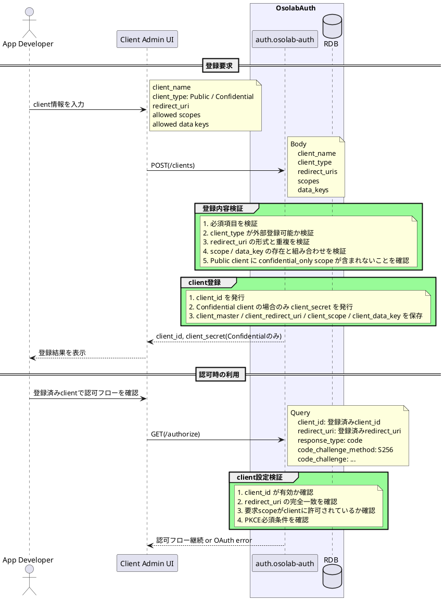

# Client Registration Flow

## 概要

OAuth/OIDC client を登録する管理フロー。
画面は Portal / 管理UIの責務で、Auth backend は登録APIと検証ロジックのみを持つ。

## シーケンス

```plantuml
@startuml
actor "App Developer" as Developer
participant "Client Admin UI" as UI
box OsolabAuth #0000ff0f
    participant "auth.osolab-auth" as Auth
    database RDB
end box

== 登録要求 ==
Developer -> UI : client情報を入力
note right
    client_name
    client_type: Public / Confidential
    redirect_uri
    allowed scopes
    allowed data keys
end note

UI -> Auth : POST(/clients)
note right
    Body
        client_name
        client_type
        redirect_uris
        scopes
        data_keys
end note

group #PaleGreen 登録内容検証
    note over Auth,RDB
        1. 必須項目を検証
        2. client_type が外部登録可能か検証
        3. redirect_uri の形式と重複を検証
        4. scope / data_key の存在と組み合わせを検証
        5. Public client に confidential_only scope が含まれないことを確認
    end note
end

group #PaleGreen client登録
    note over Auth,RDB
        1. client_id を発行
        2. Confidential client の場合のみ client_secret を発行
        3. client_master / client_redirect_uri / client_scope / client_data_key を保存
    end note
end

Auth --> UI : client_id, client_secret(Confidentialのみ)
UI --> Developer : 登録結果を表示

== 認可時の利用 ==
Developer -> UI : 登録済みclientで認可フローを確認
UI -> Auth : GET(/authorize)
note right
    Query
        client_id: 登録済みclient_id
        redirect_uri: 登録済みredirect_uri
        response_type: code
        code_challenge_method: S256
        code_challenge: ...
end note

group #PaleGreen client設定検証
    note over Auth,RDB
        1. client_id が有効か確認
        2. redirect_uri の完全一致を確認
        3. 要求scopeがclientに許可されているか確認
        4. PKCE必須条件を確認
    end note
end

Auth --> UI : 認可フロー継続 or OAuth error
@enduml
```
