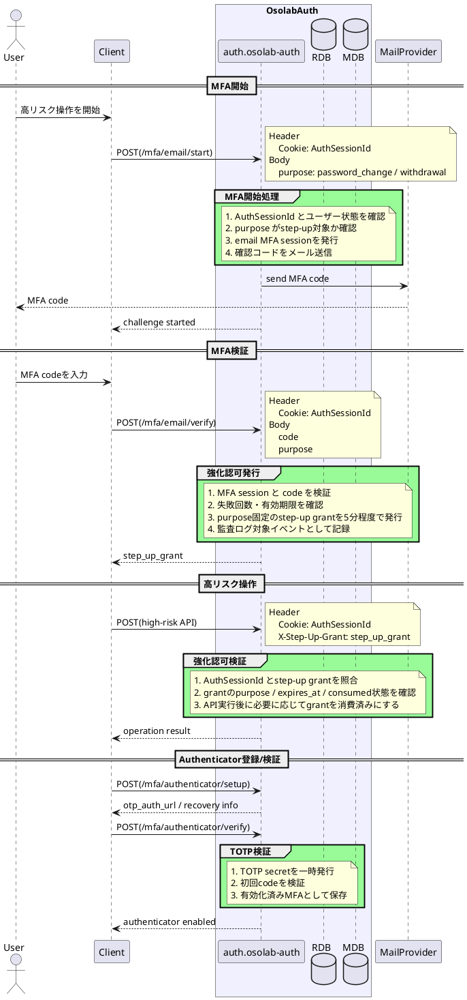

# MFA / Step-up Authorization Flow

## 概要

メールコードまたはAuthenticatorアプリで多要素認証を行い、退会・パスワード変更などの高リスク操作に必要な短命の強化認可状態を発行する。

## シーケンス

## 注意点

- 通常ログインセッションとstep-up grantは別に管理する。
- step-up grantはpurposeを固定し、短命にする。
- 失敗回数制限と監査ログを前提にする。
