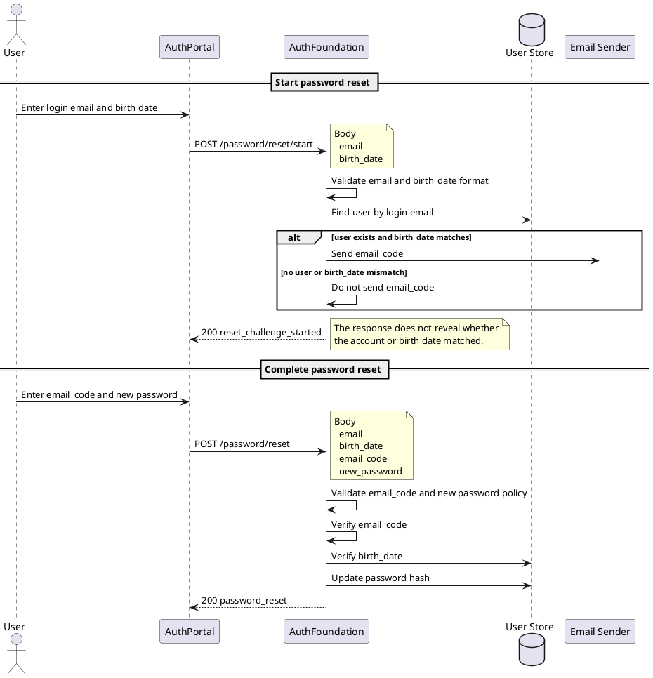

# Password Reset Flow

```plantuml
@startuml
actor User
participant AuthPortal as portal
participant AuthFoundation as auth
database "User Store" as user_store
participant "Email Sender" as mail

== Start password reset ==
User -> portal : Enter login email and birth date
portal -> auth : POST /password/reset/start
note right
  Body
    email
    birth_date
end note

auth -> auth : Validate email and birth_date format
auth -> user_store : Find user by login email

alt user exists and birth_date matches
  auth -> mail : Send email_code
else no user or birth_date mismatch
  auth -> auth : Do not send email_code
end

auth --> portal : 200 reset_challenge_started
note right
  The response does not reveal whether
  the account or birth date matched.
end note

== Complete password reset ==
User -> portal : Enter email_code and new password
portal -> auth : POST /password/reset
note right
  Body
    email
    birth_date
    email_code
    new_password
end note

auth -> auth : Validate email_code and new password policy
auth -> auth : Verify email_code
auth -> user_store : Verify birth_date
auth -> user_store : Update password hash
auth --> portal : 200 password_reset
@enduml
```
