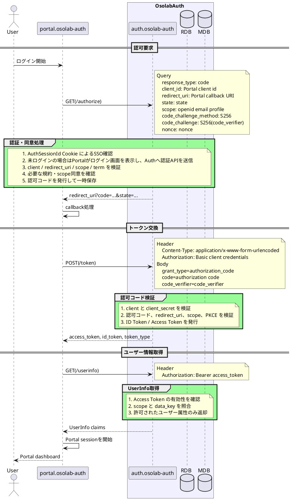

# Portal Login Flow

## 概要

Portal を OIDC Client として扱う Authorization Code Flow。
画面表示は Portal 側の責務とし、Auth backend の API として画面表示エンドポイントは定義しない。

## シーケンス

```plantuml
@startuml
actor User
participant "portal.osolab-auth" as Portal
box OsolabAuth #0000ff0f
    participant "auth.osolab-auth" as Auth
    database RDB
    database MDB
end box

== 認可要求 ==
User -> Portal : ログイン開始
Portal -> Auth : GET(/authorize)
note right
    Query
        response_type: code
        client_id: Portal client id
        redirect_uri: Portal callback URI
        state: state
        scope: openid email profile
        code_challenge_method: S256
        code_challenge: S256(code_verifier)
        nonce: nonce
end note

group #PaleGreen 認証・同意処理
    note over User,MDB
        1. AuthSessionId Cookie によるSSO確認
        2. 未ログインの場合はPortalがログイン画面を表示し、Authへ認証APIを送信
        3. client / redirect_uri / scope / term を検証
        4. 必要な規約・scope同意を確認
        5. 認可コードを発行して一時保存
    end note
end

Auth --> Portal : redirect_uri?code=...&state=...
Portal -> Portal : callback処理

== トークン交換 ==
Portal -> Auth : POST(/token)
note right
    Header
        Content-Type: application/x-www-form-urlencoded
        Authorization: Basic client credentials
    Body
        grant_type=authorization_code
        code=authorization code
        code_verifier=code_verifier
end note

group #PaleGreen 認可コード検証
    note over Auth,MDB
        1. client と client_secret を検証
        2. 認可コード、redirect_uri、scope、PKCE を検証
        3. ID Token / Access Token を発行
    end note
end

Portal <-- Auth : access_token, id_token, token_type

== ユーザー情報取得 ==
Portal -> Auth : GET(/userinfo)
note right
    Header
        Authorization: Bearer access_token
end note

group #PaleGreen UserInfo取得
    note over Auth,RDB
        1. Access Token の有効性を確認
        2. scope と data_key を照合
        3. 許可されたユーザー属性のみ返却
    end note
end

Portal <-- Auth : UserInfo claims
Portal -> Portal : Portal sessionを開始
User <-- Portal : Portal dashboard
@enduml
```
