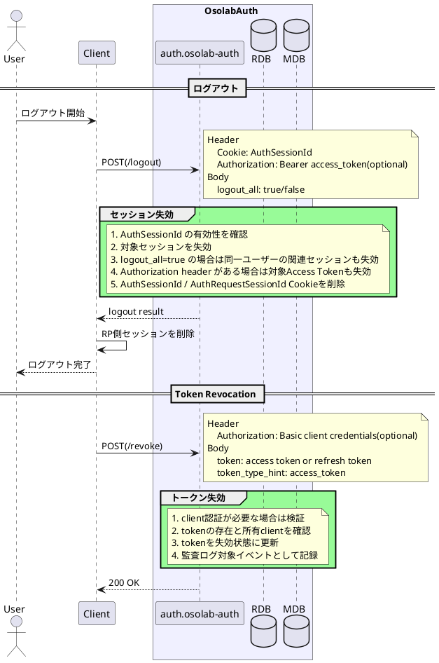

# Sign-out / Token Revocation Flow

## 概要

Auth Session と Access Token を失効させるフロー。
詳細なRedis操作はシーケンス図では展開せず、AuthorizationCodeFlow と同じ粒度で内部処理として要約する。

## シーケンス

```plantuml
@startuml
actor User
participant Client
box OsolabAuth #0000ff0f
    participant "auth.osolab-auth" as Auth
    database RDB
    database MDB
end box

== ログアウト ==
User -> Client : ログアウト開始
Client -> Auth : POST(/logout)
note right
    Header
        Cookie: AuthSessionId
        Authorization: Bearer access_token(optional)
    Body
        logout_all: true/false
end note

group #PaleGreen セッション失効
    note over Auth,MDB
        1. AuthSessionId の有効性を確認
        2. 対象セッションを失効
        3. logout_all=true の場合は同一ユーザーの関連セッションも失効
        4. Authorization header がある場合は対象Access Tokenも失効
        5. AuthSessionId / AuthRequestSessionId Cookieを削除
    end note
end

Auth --> Client : logout result
Client -> Client : RP側セッションを削除
User <-- Client : ログアウト完了

== Token Revocation ==
Client -> Auth : POST(/revoke)
note right
    Header
        Authorization: Basic client credentials(optional)
    Body
        token: access token or refresh token
        token_type_hint: access_token
end note

group #PaleGreen トークン失効
    note over Auth,MDB
        1. client認証が必要な場合は検証
        2. tokenの存在と所有clientを確認
        3. tokenを失効状態に更新
        4. 監査ログ対象イベントとして記録
    end note
end

Auth --> Client : 200 OK
@enduml
```
