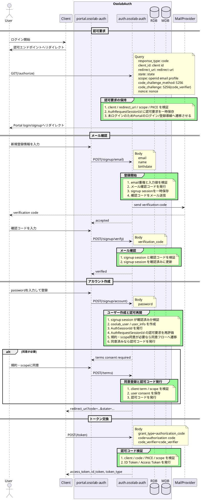

# Signup Flow

## 概要

Authorization Code Flow の途中で未登録ユーザーがアカウント登録するフロー。
画面表示は Portal 側の責務とし、Auth backend は登録・メール検証・認可再開のAPIだけを扱う。

## シーケンス

```plantuml
@startuml
actor User
participant Client
box OsolabAuth #0000ff0f
    participant "portal.osolab-auth" as Portal
    participant "auth.osolab-auth" as Auth
    database RDB
    database MDB
end box
participant "MailProvider" as Mail

== 認可要求 ==
User -> Client : ログイン開始
User <- Client : 認可エンドポイントへリダイレクト
User -> Auth : GET(/authorize)
note right
    Query
        response_type: code
        client_id: client id
        redirect_uri: redirect uri
        state: state
        scope: openid email profile
        code_challenge_method: S256
        code_challenge: S256(code_verifier)
        nonce: nonce
end note

group #PaleGreen 認可要求の保持
    note over Auth,MDB
        1. client / redirect_uri / scope / PKCE を検証
        2. AuthRequestSessionId に認可要求を一時保存
        3. 未ログインのためPortalのログイン/登録導線へ遷移させる
    end note
end

Auth --> User : Portal login/signupへリダイレクト

== メール確認 ==
User -> Portal : 新規登録情報を入力
Portal -> Auth : POST(/signup/email)
note right
    Body
        email
        name
        birthdate
end note

group #PaleGreen 登録開始
    note over Auth,MDB
        1. email重複と入力値を検証
        2. メール確認コードを発行
        3. signup sessionを一時保存
        4. 確認コードをメール送信
    end note
end

Auth -> Mail : send verification code
Mail --> User : verification code
Auth --> Portal : accepted

User -> Portal : 確認コードを入力
Portal -> Auth : POST(/signup/verify)
note right
    Body
        verification_code
end note

group #PaleGreen メール確認
    note over Auth,MDB
        1. signup session と確認コードを検証
        2. signup session を確認済みに更新
    end note
end

Auth --> Portal : verified

== アカウント作成 ==
User -> Portal : passwordを入力して登録
Portal -> Auth : POST(/signup/account)
note right
    Body
        password
end note

group #PaleGreen ユーザー作成と認可再開
    note over Auth,RDB
        1. signup session が確認済みか検証
        2. osolab_user / user_info を作成
        3. AuthSessionId を発行
        4. AuthRequestSessionId の認可要求を再評価
        5. 規約・scope同意が必要なら同意フローへ遷移
        6. 同意済みなら認可コードを発行
    end note
end

alt 同意が必要
    Auth --> Portal : terms consent required
    User -> Portal : 規約・scopeに同意
    Portal -> Auth : POST(/terms)
    group #PaleGreen 同意登録と認可コード発行
        note over Auth,MDB
            1. client term / scope を検証
            2. user consent を保存
            3. 認可コードを発行
        end note
    end
end

Auth --> Client : redirect_uri?code=...&state=...

== トークン交換 ==
Client -> Auth : POST(/token)
note right
    Body
        grant_type=authorization_code
        code=authorization code
        code_verifier=code_verifier
end note

group #PaleGreen 認可コード検証
    note over Auth,MDB
        1. client / code / PKCE / scope を検証
        2. ID Token / Access Token を発行
    end note
end

Client <-- Auth : access_token, id_token, token_type
@enduml
```
