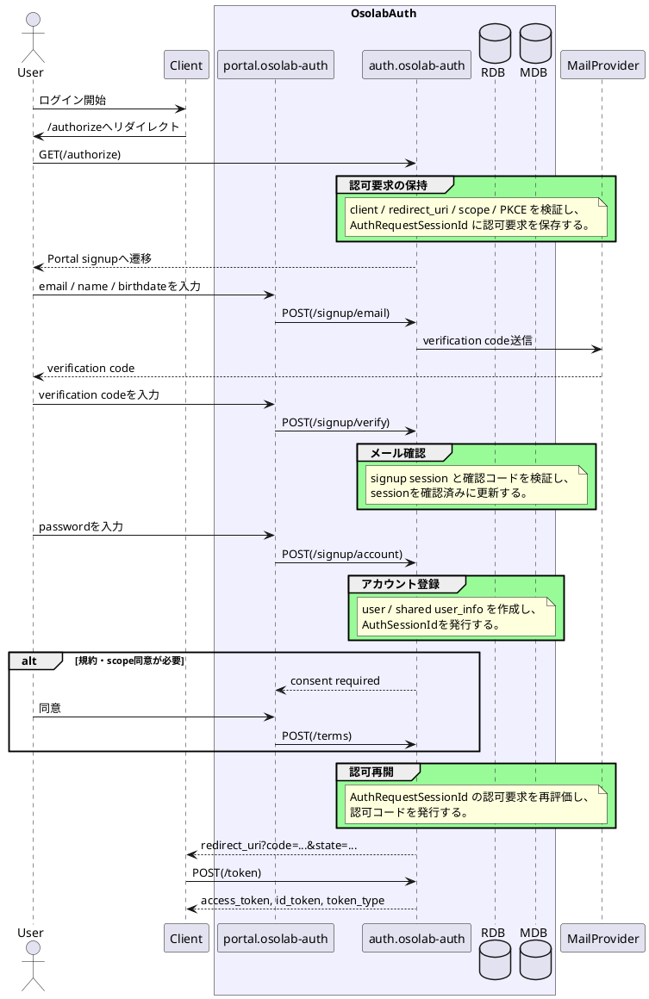

# Signup Flow (Summary)

## 概要

Signup Flow の要約版。詳細な境界は `Signup.md` と同じく、画面表示をPortal、認証・登録APIをAuth backendの責務として分離する。

## シーケンス

```plantuml
@startuml
actor User
participant Client
box OsolabAuth #0000ff0f
    participant "portal.osolab-auth" as Portal
    participant "auth.osolab-auth" as Auth
    database RDB
    database MDB
end box
participant "MailProvider" as Mail

User -> Client : ログイン開始
User <- Client : /authorizeへリダイレクト
User -> Auth : GET(/authorize)

group #PaleGreen 認可要求の保持
    note over Auth,MDB
        client / redirect_uri / scope / PKCE を検証し、
        AuthRequestSessionId に認可要求を保存する。
    end note
end

Auth --> User : Portal signupへ遷移
User -> Portal : email / name / birthdateを入力
Portal -> Auth : POST(/signup/email)
Auth -> Mail : verification code送信
Mail --> User : verification code

User -> Portal : verification codeを入力
Portal -> Auth : POST(/signup/verify)

group #PaleGreen メール確認
    note over Auth,MDB
        signup session と確認コードを検証し、
        sessionを確認済みに更新する。
    end note
end

User -> Portal : passwordを入力
Portal -> Auth : POST(/signup/account)

group #PaleGreen アカウント登録
    note over Auth,RDB
        user / shared user_info を作成し、
        AuthSessionIdを発行する。
    end note
end

alt 規約・scope同意が必要
    Auth --> Portal : consent required
    User -> Portal : 同意
    Portal -> Auth : POST(/terms)
end

group #PaleGreen 認可再開
    note over Auth,MDB
        AuthRequestSessionId の認可要求を再評価し、
        認可コードを発行する。
    end note
end

Auth --> Client : redirect_uri?code=...&state=...
Client -> Auth : POST(/token)
Auth --> Client : access_token, id_token, token_type
@enduml
```
